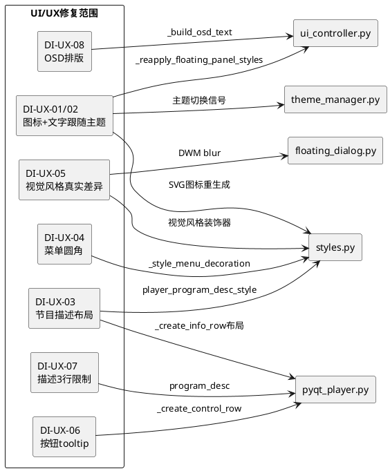

# **1. 实现模型**

## **1.1 上下文视图**

本设计文档针对IPTV Scanner Editor Pro项目的8个UI/UX问题（DI-UX-01至DI-UX-08）提供技术实现方案。修改范围聚焦于以下模块：

- `ui/styles.py`：样式核心（图标SVG生成、QSS样式函数、视觉风格装饰器）
- `ui/theme_manager.py`：主题管理器（主题切换、窗口样式重刷）
- `controllers/ui_controller.py`：UI控制器（控制面板样式重刷、OSD文本构建）
- `pyqt_player.py`：主窗口（控制面板构建、节目描述区域布局）
- `ui/floating_dialog.py`：浮动对话框（毛玻璃DWM blur逻辑）



## **1.2 服务/组件总体架构**

修改不引入新的组件或服务，仅在现有架构内增强以下功能：

1. **图标主题跟随系统**：增强 `_reapply_floating_panel_styles()` 和 `ThemeManager._reapply_main_window_components()` 确保所有控制面板图标在主题切换时重新生成SVG
2. **文字颜色跟随系统**：增强 `_reapply_floating_panel_styles()` 确保所有QLabel文字颜色重新应用
3. **节目描述布局**：修改 `_create_info_row()` 中的 `program_desc` 布局参数和 `player_program_desc_style()` 的CSS
4. **菜单圆角修复**：修改 `_style_menu_decoration()` 和 `player_menu_bar_style()` 确保QMenu的圆角与背景一致
5. **视觉风格真实差异**：增强 `_style_btn_decoration()`、`_style_slider_decoration()` 等视觉装饰器；增强DWM blur在毛玻璃风格下的生效逻辑
6. **按钮tooltip**：在 `_create_control_row()` 中补充缺失的tooltip
7. **描述3行限制**：在 `update_media_info()` 中对节目描述文本进行3行截断
8. **OSD排版优化**：增强 `_build_osd_text()` 的排版格式

## **1.3 实现设计文档**

### DI-UX-01：控制面板图标跟随主题切换

**问题分析**：
- 当前 `_reapply_floating_panel_styles()` 已实现部分图标重生成（play/stop/prev/next/volume/speed/aspect/audio_track/subtitle/pip/fullscreen）
- 媒体信息行图标（video_info_icon/audio_info_icon/network_info_icon）也已处理
- 但存在潜在遗漏：图标缓存key基于 `{name}_{size}_{color}` 格式，主题切换后颜色变化时新key会生成新SVG，但旧SVG不会被清理（DI-PERF-02，本设计不处理）

**修改方案**：
无需新增修改。当前 `_reapply_floating_panel_styles()` 已覆盖所有控制面板图标按钮的SVG重生成。需验证以下按钮均被处理：

| 按钮属性 | 图标名 | 当前处理状态 |
|---------|--------|------------|
| play_button | play/pause | 已处理（行855-859） |
| stop_button | stop | 已处理（行844-854） |
| prev_ch_button | prev | 已处理 |
| next_ch_button | next | 已处理 |
| volume_button | volume/volume_low/volume_mute | 已处理（行840-843） |
| speed_button | speed | 已处理 |
| aspect_button | aspect | 已处理 |
| audio_track_button | audio_track | 已处理 |
| sub_track_button | subtitle | 已处理 |
| pip_button | pip | 已处理 |
| fullscreen_button | fullscreen | 已处理 |
| exit_catchup_button | prev | 已处理（行860-864） |
| video_info_icon | tv | 已处理（行811-819） |
| audio_info_icon | speaker | 已处理 |
| network_info_icon | signal | 已处理 |

**验证方式**：切换主题后逐一检查每个按钮图标颜色是否变化。

---

### DI-UX-02：控制面板文字颜色跟随主题切换

**问题分析**：
- 当前 `_reapply_floating_panel_styles()` 已对以下QLabel逐一重设样式：
  - video_info, audio_info, network_info, buffer_info → `player_media_badge_style()`
  - channel_name → `player_channel_name_style()`
  - current_program → `player_program_style()`
  - program_desc → `player_program_desc_style()`
  - time_label → `player_time_badge_style()`
  - remain_label → `player_status_badge_style()`
  - progress_start, progress_end → `player_progress_label_style()`
  - catchup_indicator → `player_catchup_indicator_style()`
- 通用QLabel处理：行884-896 遍历面板中所有QLabel，对含 `color:` 的label重设 `player_label_style()`

**潜在遗漏**：
1. `channel_logo` QLabel 设置了 `player_channel_logo_style()`，但该样式可能不含color属性
2. 某些动态创建的QLabel可能未在objectName排除列表中，被通用逻辑覆盖也可能遗漏

**修改方案**：
- 在 `_reapply_floating_panel_styles()` 的通用QLabel遍历中，对所有非图标、非已单独处理的QLabel统一设置文字颜色，确保无遗漏
- 具体修改：移除通用遍历中的objectName排除判断，改为对所有不含pixmap的QLabel统一应用 `player_label_style()`（除非已有专门的objectName处理）

**修改位置**：`controllers/ui_controller.py` `_reapply_floating_panel_styles()` 行884-896

**修改逻辑**：
```python
# 原逻辑：仅对含 'color:' 的label重设
# 新逻辑：对所有非图标label统一重设文字颜色
for label in fp.findChildren(QLabel):
    name = label.objectName()
    if name in ('program_desc', 'current_program', 'channel_name', 'channel_logo',
                'time_label', 'remain_label', 'progress_start', 'progress_end',
                'video_info', 'audio_info', 'network_info', 'buffer_info',
                'video_info_icon', 'audio_info_icon', 'network_info_icon',
                'catchup_indicator'):
        continue
    if label.pixmap() is not None:
        continue
    # 统一重设文字颜色，不再检查existing是否含 'color:'
    label.setStyleSheet(AppStyles.player_label_style())
```

---

### DI-UX-03：节目描述区域布局问题

**问题分析**：
- `program_desc` 当前设置：`setFixedHeight(54)` + CSS `max-height: 54px` + `setWordWrap(True)`
- 布局位置：program_desc在 `text_layout` 中位于 channel_name/current_program行下方，但 `text_layout.addStretch(1)` 在program_desc之后，导致描述区被推到靠近底部
- 描述文字超过3行时可能与底部控制按钮和分割线重叠

**修改方案**：

1. **移除固定高度，改为3行自适应**：
   - 删除 `self.program_desc.setFixedHeight(54)`
   - 修改 `player_program_desc_style()` 中移除 `max-height: 54px`
   - 在CSS中设置 `max-height` 为3行高度（约48px，基于font-size:14px × 3行 + padding）
   - 添加 `-qt-line-wrap-mode: word;` 确保换行

2. **布局位置靠近上方标题**：
   - 将 `text_layout.addStretch(1)` 从program_desc之后移到program_desc之前
   - 这样描述区紧贴在标题行下方，stretch占据底部空间

**修改位置**：
- `pyqt_player.py` `_create_info_row()` 行1272-1283
- `ui/styles.py` `player_program_desc_style()` 行1985-1997

**具体修改**：

`pyqt_player.py` 修改：
```python
# 行1272-1283 修改为：
self.program_desc = QLabel(...)
self.program_desc.setObjectName("program_desc")
self.program_desc.setStyleSheet(AppStyles.player_program_desc_style())
self.program_desc.setAutoFillBackground(False)
self.program_desc.setAttribute(Qt.WidgetAttribute.WA_TranslucentBackground, True)
self.program_desc.setWordWrap(True)
self.program_desc.setAlignment(Qt.AlignmentFlag.AlignTop | Qt.AlignmentFlag.AlignLeft)
# 不设置fixedHeight，由CSS的max-height控制3行
self.program_desc.setSizePolicy(QSizePolicy.Policy.Preferred, QSizePolicy.Policy.Maximum)
text_layout.addWidget(self.program_desc, 0, Qt.AlignmentFlag.AlignTop)
# 移除text_layout.addStretch(1)——不再需要stretch将描述推向底部
```

`ui/styles.py` 修改：
```python
# player_program_desc_style() 修改为：
def player_program_desc_style() -> str:
    colors = AppStyles._get_colors()
    return f"""
        QLabel {{
            color: {colors['player_panel_secondary']};
            font-size: 14px;
            background-color: transparent;
            padding: 0px;
            margin: 0px;
            border: none;
            max-height: 48px;
        }}
    """
```

---

### DI-UX-04：菜单栏圆角样式不一致

**问题分析**：
- QMenu展开时出现圆角外边直角背景，是因为QMenu的 `background-color` 和 `border-radius` 设置不匹配
- 当QMenu设置了 `border-radius` 但未同时设置 `background-color` 为透明或在圆角范围内时，Qt会在圆角外绘制直角背景
- 当前 `_style_menu_decoration()` 返回的CSS包含 `background-color` 和 `border`，但QMenu的背景绘制可能未被正确裁剪到圆角区域

**修改方案**：

1. **增强 `player_menu_bar_style()` 中QMenu的CSS**：
   - 为QMenu添加 `border-radius` 与当前视觉风格的 `_get_style_border_radius()` 一致
   - 确保QMenu的 `background-color` 和 `border-radius` 同时设置

2. **修改 `_style_menu_decoration()` 返回值**：
   - 在返回的CSS中显式加入 `border-radius` 以匹配圆角

**修改位置**：`ui/styles.py` `_style_menu_decoration()` 行1023-1038 和 `player_menu_bar_style()` 行2272-2348

**具体修改**：

`_style_menu_decoration()` 修改：
```python
@classmethod
def _style_menu_decoration(cls, colors):
    c = colors
    style = cls._visual_style
    r = cls._get_style_border_radius()
    menu_r = max(r - 2, 4)  # 菜单圆角略小于组件圆角
    if style == 'neumorphic':
        return f"background-color: {c['base']}; padding: 4px; border: 2px solid; border-top-color: {c['shadow_light']}; border-left-color: {c['shadow_light']}; border-bottom-color: {c['shadow_dark']}; border-right-color: {c['shadow_dark']}; border-radius: {menu_r}px;"
    elif style == 'skeuomorphic':
        return f"background-color: {c['base']}; padding: 4px; border: 2px outset {c.get('border_3d_light', c['mid'])}; border-radius: {menu_r}px;"
    elif style == 'frosted':
        return f"background-color: {c['base']}; padding: 4px; border: 1px solid rgba(255,255,255,0.1); border-radius: {menu_r}px;"
    elif style == 'win11':
        return f"background-color: {c['base']}; padding: 4px; border: 1px solid {c.get('border_thin', c['mid'])}; border-radius: {menu_r}px;"
    elif style == 'mac':
        return f"background-color: {c['base']}; padding: 4px; border: none; border-radius: {menu_r}px;"
    elif style == 'ios':
        return f"background-color: {c['base']}; padding: 4px; border: none; border-radius: {menu_r}px;"
    return f"background-color: {c['base']}; padding: 2px; border: 1px solid {c['mid']}; border-radius: {menu_r}px;"
```

`player_menu_bar_style()` 中QMenu部分确保引用了 `_style_menu_decoration()` 返回的border-radius：
```python
QMenu {{
    color: {menu_text};
    {menu_dec}
    /* menu_dec已包含border-radius */
}}
```

---

### DI-UX-05：视觉风格切换产生真实差异

**问题分析**：
- 7种视觉风格（neumorphic/flat/skeuomorphic/frosted/win11/mac/ios）的差异化主要体现在：
  - `_style_btn_decoration()`：按钮外观（已区分各风格的border/shadow/gradient）
  - `_style_slider_decoration()`：滑块外观（已区分各风格）
  - `_style_menu_decoration()`：菜单外观（已区分各风格）
  - `_get_style_border_radius()`：圆角大小（各风格不同值）
  - `_get_style_inset()`/`_get_style_raised()`：拟态凹凸效果
- **毛玻璃效果**：当前仅在 `FloatingDockWidget.paintEvent()` 和 `FloatingDialog.paintEvent()` 中通过DWM API设置半透明背景，主窗口 `ThemeManager._apply_window_backdrop()` 中也处理了DWM blur
- **问题**：毛玻璃效果依赖Windows DWM API，在非Windows平台降级为仅改背景色；frosted风格的DWM blur可能未在所有窗口上生效

**修改方案**：

1. **增强毛玻璃效果的真实性**：
   - 在 `_apply_window_backdrop()` 中，当 `visual_style == 'frosted'` 时，对所有已注册窗口（包括QDialog子类）都启用DWM blur
   - 在 `FloatingDockWidget` 和 `FloatingDialog` 的 `paintEvent()` 中，frosted风格下使用更低的opacity使背景更透明，DWM blur效果更明显

2. **确保7种风格在控制面板上有可辨识的差异**：
   - 当前 `player_panel_style()` 中 `QToolButton` 和 `QPushButton` 已使用 `btn_dec` 变量区分风格
   - 验证 `player_button_style()` 中 `_style_btn_decoration()` 对各风格返回的CSS确实有视觉差异

3. **增强非Windows平台的毛玻璃降级方案**：
   - 在非Windows平台，frosted风格使用 `QGraphicsBlurEffect` 模拟模糊效果（作为降级方案）

**修改位置**：
- `ui/theme_manager.py` `_apply_window_backdrop()` 行82-92
- `ui/floating_dialog.py` `FloatingDockWidget.paintEvent()` 行116-149 和 `FloatingDialog.paintEvent()` 行214-275

**具体修改**：

`theme_manager.py` 修改 — 增强DWM blur对子窗口的应用：
```python
def _apply_window_backdrop(self, window):
    try:
        is_frosted = AppStyles._visual_style == 'frosted'
        if isinstance(window, QtWidgets.QMainWindow):
            window.setAttribute(QtCore.Qt.WidgetAttribute.WA_TranslucentBackground, True)
            if is_frosted:
                self._enable_dwm_blur(window)
                # 对主窗口的所有子对话框也启用blur
                for child in window.findChildren(QtWidgets.QDialog):
                    child.setAttribute(QtCore.Qt.WidgetAttribute.WA_TranslucentBackground, True)
                    self._enable_dwm_blur(child)
            else:
                self._disable_dwm_blur(window)
    except Exception as e:
        print(f"设置窗口背景模糊失败: {e}")
```

`floating_dialog.py` 修改 — frosted风格下降低opacity使blur更可见：
```python
# FloatingDockWidget.paintEvent() 中
if is_frosted:
    opacity = int(colors.get('frosted_opacity', 0.65) * 255)  # 从0.78降到0.65，使DWM blur更明显
    ...
```

---

### DI-UX-06：控制面板按钮tooltip

**问题分析**：
- 当前 `_create_control_row()` 中已为以下按钮设置tooltip：
  - play_button → "播放/暂停"
  - stop_button → "停止"
  - prev_ch_button → "上一频道"
  - next_ch_button → "下一频道"
  - volume_button → "音量"
  - exit_catchup_button → "退出回看"
  - speed_button → "播放速度"
  - aspect_button → "画面比例"
  - audio_track_button → "Audio Track"
  - sub_track_button → "Subtitle"
  - pip_button → "画中画"
  - fullscreen_button → "全屏"

- **潜在遗漏**：
  - volume_slider（音量滑块）无tooltip
  - progress_start/progress_end（时间标签）无tooltip（但这些是标签不是按钮，可忽略）
  - program_progress（进度条滑块）无tooltip

**修改方案**：

为 `volume_slider` 和 `program_progress` 添加tooltip。

**修改位置**：`pyqt_player.py` `_create_control_row()` 行1396-1402（volume_slider）和行1365-1376（program_progress）

**具体修改**：
```python
# volume_slider 添加tooltip
self.volume_slider = QSlider(Qt.Orientation.Horizontal)
self.volume_slider.setRange(0, 100)
self.volume_slider.setValue(80)
self.volume_slider.setFixedWidth(90)
self.volume_slider.setStyleSheet(AppStyles.player_volume_slider_style())
self.volume_slider.valueChanged.connect(self.set_volume)
self.volume_slider.setToolTip(tr("panel_volume_slider", "音量调节"))

# program_progress 添加tooltip
self.program_progress = CacheProgressSlider(Qt.Orientation.Horizontal)
self.program_progress.setToolTip(tr("panel_progress", "节目进度"))
```

---

### DI-UX-07：节目描述最多显示3行

**问题分析**：
- 此问题与DI-UX-03关联，DI-UX-03已处理了CSS的 `max-height` 限制
- 但还需在代码层面确保传入的文本被截断为3行，避免文字溢出max-height后不可见但占空间

**修改方案**：

在 `update_media_info()` 或设置 `program_desc.setText()` 的地方，对文本进行3行截断。

**修改位置**：`controllers/ui_controller.py` `update_media_info()` 方法中设置 `program_desc` 文本的位置

**具体修改**：
添加一个辅助方法截断文本为3行：
```python
@staticmethod
def _truncate_to_lines(text: str, max_lines: int = 3) -> str:
    """将文本截断为最多max_lines行"""
    if not text:
        return text
    lines = text.split('\n')
    if len(lines) <= max_lines:
        return text
    return '\n'.join(lines[:max_lines]) + '...'
```

在设置 `program_desc.setText()` 之前调用此方法。

需找到所有设置 `program_desc` 文本的位置并统一处理。通过搜索 `program_desc.setText` 或 `program_desc` 文本设置来确定修改点。

---

### DI-UX-08：OSD显示内容美观排版

**问题分析**：
- 当前 `_build_osd_text()` 已实现结构化排版，按行组织信息：
  - 第1行：频道名
  - 第2行：分辨率 + 编码 + 帧率 + 宽高比 + 硬解 + HDR
  - 第3行：像素格式 + 色彩矩阵 + 色彩初选 + 传输函数 + 色彩范围 + 峰值 + 平均
  - 第4行：音频编码 + 声道 + 采样率 + 音频码率
  - 第5行：视频码率 + 缓存速度
  - 第6行：容器 + 协议 + 解复用器
  - 第7行：URL
  - 第8行：播放进度或直播标识

**潜在改进**：
1. 当前行内用双空格 `'  '` 分隔，可改为更美观的分隔符如 `│` 或 `·`
2. OSD文本通过MPV的 `show-text` 命令显示，MPV自身的OSD渲染能力有限，无法控制字体/颜色/布局
3. 可以在每行前添加分类标识符使信息更直观

**修改方案**：

1. **优化行内分隔符**：将 `'  '` 改为 `' │ '` 使信息列分隔更清晰
2. **添加行首分类标识**：每行添加简短标签前缀
3. **格式化数字**：统一数字显示格式

**修改位置**：`controllers/ui_controller.py` `_build_osd_text()` 行75-229

**具体修改**：
```python
def _build_osd_text(self, info: Dict[str, Any], pc) -> str:
    lines = []
    
    current = self.window.current_channel
    channel_name = ''
    play_url = ''
    if current and isinstance(current, dict):
        channel_name = current.get('name', '') or ''
        play_url = current.get('url', '') or ''
    
    if channel_name:
        lines.append(f'▶ {channel_name}')  # 添加播放标识
    
    tr = self.window.language_manager.tr
    sep = ' │ '  # 使用竖线分隔符
    
    # 视频信息行
    vline = []
    w = info.get('width', 0) or 0
    h = info.get('height', 0) or 0
    dw = info.get('dwidth', 0) or 0
    dh = info.get('dheight', 0) or 0
    if w > 0 and h > 0:
        res = f'{w}x{h}'
        if dw > 0 and dh > 0 and (dw != w or dh != h):
            res += f' ({dw}x{dh})'
        vline.append(f'{tr("osd_resolution", "Resolution")}: {res}')
    
    vcodec = info.get('video_codec', '') or ''
    if vcodec:
        vline.append(f'{tr("osd_codec", "Codec")}: {vcodec}')
    
    fps = info.get('fps', 0) or 0
    if fps > 0:
        fps_str = f'{fps:.2f}' if fps < 10 else f'{fps:.1f}'
        vline.append(f'{tr("osd_fps", "FPS")}: {fps_str}')
    
    # ... 其余信息同理，使用sep连接 ...
    
    if vline:
        lines.append(sep.join(vline))
    
    # ... 后续行同理 ...
    
    return '\n'.join(lines)
```

注意：MPV的OSD显示不支持emoji，因此 `▶` 等Unicode符号需要确认MPV能正确渲染。如果MPV不支持，改用纯ASCII符号如 `>` 。

---

# **2. 接口设计**

## **2.1 总体设计**

本次修改不引入新接口，仅修改现有方法的实现逻辑和CSS输出。

## **2.2 接口清单**

| 接口 | 类型 | 修改说明 |
|------|------|---------|
| `UIController._reapply_floating_panel_styles()` | 方法修改 | 增强QLabel文字颜色重设逻辑，确保所有label都跟随主题 |
| `UIController._truncate_to_lines(text, max_lines)` | 新增静态方法 | 截断文本为指定行数 |
| `UIController._build_osd_text(info, pc)` | 方法修改 | 优化OSD排版分隔符和格式 |
| `ThemeManager._apply_window_backdrop(window)` | 方法修改 | 增强DWM blur对子窗口的应用 |
| `AppStyles.player_program_desc_style()` | 方法修改 | 修改max-height为48px |
| `AppStyles._style_menu_decoration(colors)` | 方法修改 | 增加border-radius返回值 |
| `IPTVPlayer._create_info_row()` | 方法修改 | 移除program_desc的fixedHeight(54)，调整布局stretch |
| `IPTVPlayer._create_control_row()` | 方法修改 | 为volume_slider和program_progress添加tooltip |

---

# **4. 数据模型**

## **4.1 设计目标**

本次修改不涉及数据模型变更。

## **4.2 模型实现**

无变更。

---

# **5. 修改影响分析**

## **5.1 对现有功能的影响**

| 修改项 | 影响范围 | 风险评估 |
|--------|---------|---------|
| _reapply_floating_panel_styles QLabel遍历 | 控制面板所有QLabel | 低：仅扩展覆盖范围，不改变已处理label的逻辑 |
| program_desc布局修改 | 控制面板节目描述区 | 中：移除fixedHeight可能导致面板高度变化，需测试 |
| _style_menu_decoration增加border-radius | 所有QMenu | 低：仅增加CSS属性，不改变已有属性 |
| DWM blur增强 | 主窗口+对话框 | 中：DWM API调用失败时已有try/except降级 |
| tooltip添加 | volume_slider, program_progress | 低：纯新增属性，不影响功能 |
| OSD排版修改 | 视频区域OSD显示 | 低：仅改变文本格式，不改变信息内容 |
| frosted_opacity降低 | 毛玻璃视觉效果 | 低：仅改变透明度数值 |

## **5.2 现有功能对本修改的影响**

| 现有功能 | 影响说明 |
|---------|---------|
| 主题切换机制 | ThemeManager.theme_changed信号已连接所有相关组件，修改后需确保信号传递链完整 |
| SVG图标缓存 | 图标颜色变化时生成新key，旧缓存不清理（已知DI-PERF-02，本设计不处理） |
| MPV OSD渲染 | MPV的show-text命令对Unicode字符支持有限，需验证分隔符渲染效果 |
| 非Windows平台 | DWM blur降级为改背景色，frosted风格差异在非Windows平台不明显 |

---

# **6. 验收条件**

| 问题编号 | 验收条件 |
|---------|---------|
| DI-UX-01 | 切换任意颜色模式或视觉风格后，控制面板中所有15个图标按钮的颜色和样式均随主题变化 |
| DI-UX-02 | 切换任意主题后，控制面板中所有文字标签的颜色均更新为新主题对应颜色，无旧颜色残留 |
| DI-UX-03 | 节目描述区最多显示3行，不与底部控制按钮重叠，布局靠近上方标题行 |
| DI-UX-04 | 菜单栏展开下拉菜单时，圆角外无直角背景色溢出 |
| DI-UX-05 | 7种视觉风格切换后界面有明显视觉差异；毛玻璃风格在Windows上DWM blur真实生效 |
| DI-UX-06 | 鼠标悬停在控制面板所有按钮和滑块上均显示tooltip |
| DI-UX-07 | 节目描述文本超过3行时自动截断，不溢出 |
| DI-UX-08 | OSD显示所有可用媒体信息，排版清晰美观，信息列有明确分隔 |
