# 一、需求与存量功能关系分析

本设计文档基于 spec-requirement-agent 对 IPTV Scanner Editor Pro 项目的深度审查报告（476 个 Python 文件、约 62748 行核心代码），将 40 项问题（P0 严重 Bug 3 项、P1 UI/死代码/回归 17 项、P2 架构/跨平台/工程 20 项）转化为可落地的技术设计方案。其中 29 项为既有审查问题，11 项为补充审查新增（播放卡顿回归 P0-3、T1.2 修改不彻底 P1-13/14、主题边框叠加 P1-15/16/17、跨平台兼容 P2-30~34）。

修改范围聚焦于以下模块：
- `controllers/event_handler.py`：键盘快捷键音量调节（P0-1）
- `mixins/control_panel_mixin.py`：控制面板按钮创建与"更多"菜单、panelContainer 边框（P0-2、P1-12、P1-13、P1-16）
- `mixins/playlist_panel_mixin.py`：epg/playlist panelContainer 边框声明（P1-16）
- `pyqt_player.py`：主窗口节目描述布局、状态栏样式、嵌套容器边框（P1-3、P1-6、P1-12、P1-17）
- `ui/theme_manager.py`：主题切换重刷、死方法清理、边框单一化、macOS 毛玻璃（P1-4、P1-7、P1-15、P1-17、P2-26、P2-30）
- `controllers/pip_controller.py`：画中画按钮 Unicode 改 SVG、paint 事件 pixmap 缓存（P0-3、P1-5）
- `controllers/ui_controller.py`：浮动面板样式重刷、icon_btn_map 死条目清理（P1-4、P1-14）
- `ui/styles.py`：样式核心、菜单圆角、内联样式收口、player_panel_style 边框（P1-3、P1-6、P1-15、P2-21、P2-28）
- `utils/platform_utils.py`、`utils/general_utils.py`：死函数清理、时间格式化统一、Wayland/Android 平台适配（P1-8、P1-9、P2-32、P2-33、P2-34）
- `controllers/bookmark_controller.py`、`controllers/resume_playback_controller.py`：重复函数清理（P1-9）
- `ui/floating_dialog.py`：颜色解析复用、对话框基类提取、macOS 毛玻璃、Wayland 定位（P1-10、P1-11、P2-30、P2-34）
- `ui/dialogs/*.py`：19 个对话框 DRY 重构（P1-10）
- `services/mpv_player_service.py`：上帝类拆分、跨平台 vo/gpu-context 配置（P2-13、P2-32）
- `services/mpv_gl_widget.py`：Linux WA_NativeWindow、macOS render API（P2-32）
- `core/config_manager.py`：配置域拆分（P2-14）
- `core/language_manager.py`：翻译数据外置、延迟加载（P2-16、P2-31）
- `controllers/media_controller.py`：控制器拆分（P2-15）
- `android/app/src/main/python/android_bridge.py`：Android 触摸目标尺寸、libmpv 路径（P2-33）
- 全项目：宽泛异常治理、魔法数字常量化、局部导入治理、测试覆盖（P2-17~P2-20、P2-23~P2-29）

## 1.1 需求功能与存量功能对比

### 1.1.1 已实现功能

| 需求功能 | 存量功能 | 代码位置 | 匹配度 |
|---------|---------|---------|--------|
| 控制面板图标主题跟随（P1-4 部分） | `_reapply_floating_panel_styles()` 已重刷 play/stop/prev/next/volume/speed/aspect/audio_track/subtitle/pip/fullscreen 图标 | controllers/ui_controller.py:1054-1071 | 75% |
| 控制面板文字颜色跟随主题 | `_reapply_floating_panel_styles()` 已对 channel_name/current_program/program_desc/time_label 等逐一重设样式 | controllers/ui_controller.py:884-896 | 75% |
| "更多"菜单收纳次级控制 | `_create_more_menu()` 已收纳 speed/aspect/audio_track/subtitle/pip/exit_catchup 六项 | mixins/control_panel_mixin.py:396-412 | 100% |
| 节目描述区域布局 | `_create_info_row()` 中 program_desc 已设置 WordWrap+AlignTop，位于标题行下方 | mixins/control_panel_mixin.py:210 | 50% |
| 时间格式化函数 | `format_time()` 规范实现已存在 | utils/general_utils.py:245 | 100% |
| 颜色解析函数 | `color_to_qcolor()` 规范实现已存在 | ui/styles.py:13 | 100% |
| 对话框主题应用 | 各对话框已有 `reapply_styles()`/`_apply_theme()` | ui/dialogs/*.py | 50% |
| OSD 信息构建 | `_build_osd_text()` 已实现 8 行结构化排版 | controllers/ui_controller.py:75-229 | 75% |
| 状态栏频道标签 | `_status_channel_label` 已创建并挂载 | pyqt_player.py:824-828 | 75% |
| 主题切换重刷主窗口组件 | `_reapply_main_window_components()` 已重刷标题栏/菜单栏/Dock | ui/theme_manager.py:212 | 75% |
| Wayland 浮动窗口定位 | `is_wayland()`/`wayland_move()`/`wayland_set_geometry()` 已实现，floating_dialog 已调用 setTransientParent | utils/platform_utils.py:17-52、ui/floating_dialog.py:76 | 75% |
| Linux 原生窗口属性 | video_widget 已设置 WA_NativeWindow | pyqt_player.py:789、services/mpv_gl_widget.py:63 | 75% |
| Android libmpv 路径搜索 | android_bridge 已从 nativeLibraryDir 搜索 libmpv.so | android/app/src/main/python/android_bridge.py:132 | 75% |
| macOS 透明背景 | theme_manager/floating_dialog 已设置 WA_TranslucentBackground | ui/theme_manager.py:109-136、ui/floating_dialog.py:88 | 50% |

### 1.1.2 需要扩展的功能

| 需求功能 | 存量功能 | 差异说明 | 扩展方向 |
|---------|---------|---------|---------|
| 音量快捷键生效（P0-1） | `_adjust_volume()` 委托逻辑完整，仅属性名错误 | `getattr(self.window, 'update_ctrl', None)` 误用 UpdateController，应为 `media_ctrl`；导致 hasattr 永远 False | 修正属性名为 `media_ctrl`，单行修改 |
| 控制面板冗余按钮清理（P0-2） | `_create_control_row()` 创建 5 个未挂载按钮 | speed/aspect/audio_track/sub_track/pip_button 实例化但未 addWidget，功能已由 more_menu 收纳 | 删除 audio_track/sub_track/pip_button 实例化；speed/aspect_button 改为字符串属性或直接删除 |
| PiP 按钮 paint 缓存（P0-3，新增） | `PipButton.paint_event` 每次重绘调用 `_load_pixmap`→`QPixmap(path)`→`scaled` | T2.3 引入 SVG 图标后，paint 事件每次都加载图片文件并缩放，导致画中画模式下卡顿花屏 | 在 `__init__`/`set_icon` 时加载并缓存 QPixmap 实例到 `widget._pixmap_cache`，paint 事件仅绘制缓存；icon_name 变化时才重新加载 |
| 节目描述 3 行限制（P1-3） | `PROGRAM_DESC_HEIGHT=54` 固定高度 + CSS max-height | 固定高度对 3 行偏紧，长文本可能溢出与控制按钮重叠；背景色重复设置 3 次 | 移除 fixedHeight，改用 setMaximumHeight + sizeHint 自适应；CSS max-height 设为 48px（3 行×14px+padding） |
| 控制面板图标跟随主题（P1-4） | `_reapply_main_window_components()` 重刷标题栏图标 | 未重刷控制面板 play/stop/prev/next/volume/fullscreen 等按钮图标 | 在 `_reapply_main_window_components()` 中增加对控制面板按钮图标的重刷调用 |
| 画中画按钮改 SVG（P1-5） | `_create_button()` 使用 Unicode 文本标签 | ⏸▶⏮⏭✕ Unicode 符号在视频上方显示，违反"不显示 emoji"偏好 | 改用 `AppStyles.get_icon()` 生成 SVG 图标，跟随主题颜色 |
| 状态栏样式收口（P1-6） | `_status_channel_label` 内联 `setStyleSheet("color: palette(text); padding: 0 8px;")` | 内联样式未走 AppStyles，主题切换时 `label_style()` 可能不含 padding 导致对齐错乱 | 提取到 `AppStyles.status_channel_label_style()` 命名方法 |
| speed/aspect 按钮无冗余实例（P1-13，新增） | `_create_control_row()` 仍实例化 speed_button/aspect_button 但未 addWidget 挂载 | T1.2 删除冗余按钮不彻底，speed/aspect 仍实例化；功能已由 more_menu 收纳，实例未挂载属于死代码 | 删除 speed_button/aspect_button 实例化；media_controller 中对 speed_button/aspect_button 的引用改为通过 more_menu 或字符串属性 `_speed_label`/`_aspect_label` |
| icon_btn_map 无死条目（P1-14，新增） | `_reapply_floating_panel_styles()` 的 icon_btn_map 含 audio_track_button/sub_track_button/pip_button/speed_button/aspect_button | T1.2 删除按钮后 icon_btn_map 未同步清理；getattr 返回 None 时 continue 跳过，但对 speed/aspect 仍实例化的按钮执行无效重刷 | 从 icon_btn_map 删除 audio_track_button/sub_track_button/pip_button 条目；speed/aspect 视 P1-13 处理结果决定保留或删除 |
| Dock 容器边框不叠加（P1-15，新增） | `_reapply_main_window_components()` 对 Dock container 设置 player_panel_style（含 border） | mainContainer 已有 border（非 neumorphic/mac/ios 时），Dock container 再设 border 形成两层叠加 | player_panel_style 中移除 border，或 mainContainer 在有 Dock 时移除 border；统一由最外层 mainContainer 持有边框 |
| panelContainer 创建时声明无边框（P1-16，新增） | panelContainer 创建时仅设 `background-color:transparent`，无 `border:none` | 主题切换后 player_panel_style 给 Dock container 设 border，但 panelContainer 初始无 border:none，语义不一致 | panelContainer 创建时显式声明 `border:none`，与 player_panel_style 边框策略保持一致 |
| 嵌套容器边框单一化（P1-17，新增） | mainContainer(border) → contentArea(无 border) → Dock container(player_panel_style 含 border) → panelContainer(无 border:none) | 嵌套链中 mainContainer 与 Dock container 同时有 border，形成多层可见边框 | 整条嵌套链只保留一处边框（最外层 mainContainer），Dock container/panelContainer 均设 border:none |
| 重复时间格式化统一（P1-9） | bookmark_controller/resume_playback_controller 各有 `_format_time()` | 与 `general_utils.format_time` 逻辑重复 | 删除两处私有实现，改为调用 `general_utils.format_time` |
| 19 对话框 DRY 重构（P1-10） | 各对话框 `reapply_styles` 调用 `_apply_theme`，`_apply_theme` 中 `setStyleSheet(popup_dialog_style() + 差异)` | 19 处重复模板代码，违反 DRY | 提取到 `FloatingDialog` 基类，子类只覆写 `_extra_theme_css()` 钩子 |
| 颜色解析复用（P1-11） | floating_dialog.py:25 `_parse_hex_color()` | 重复实现 hex/rgba/rgb 解析，与 `color_to_qcolor` 功能重叠 | 删除 `_parse_hex_color`，改用 `color_to_qcolor` |
| 调试日志清理（P1-12） | pyqt_player.py/control_panel_mixin.py 22+ 处 `logger.debug("xxx: 开始/完成")` | 生产环境无价值，增加噪音代码 | 删除"开始/完成"配对日志，保留有实质信息的日志 |
| macOS NSVisualEffectView 毛玻璃（P2-30，新增） | theme_manager/floating_dialog 仅设置 WA_TranslucentBackground | 无 NSVisualEffectView 原生模糊，frosted 主题下毛玻璃效果未真正实现 | 通过 PyObjC/ctypes 调用 NSVisualEffectView 实现原生毛玻璃；WA_TranslucentBackground 作为回退 |
| 翻译加载不阻塞启动（P2-31，新增） | language_manager 模块导入时同步执行 JSON I/O | T3.6 翻译外置引入模块级 I/O 副作用，阻塞首帧显示 | 改为延迟加载：模块导入仅注册加载器，首次 tr() 调用时才加载 JSON；或异步加载 |
| 跨平台 vo/gpu-context 配置完整（P2-32，新增） | mpv_player_service 已有平台分支配置 | 需审查 Windows(d3d11/vulkan)/macOS(libmpv)/Linux(gpu-next+x11egl)/Android(默认) 配置完整性 | 审查并补全四端 vo/gpu-context 配置，确保无遗漏分支 |
| Android 触摸目标尺寸（P2-33，新增） | 桌面端交互控件尺寸 32px | Android 触摸目标需 ≥ 48px，现有尺寸未区分平台 | is_android() 时控件尺寸放大到 48px；libmpv 路径搜索顺序确认 |
| Linux Wayland 浮动 Dock 定位（P2-34，新增） | floating_dialog 已有 setTransientParent/wayland_move | 需验证 Wayland 下浮动 Dock 定位/调整尺寸/startSystemResize 正常 | 验证并补全 Wayland 定位/调整逻辑，windowHandle 为 None 时回退 widget.move |
| 魔法数字常量化（P2-18） | 59 处 `QTimer.singleShot(50/100/200/500/300/0/60, ...)` | 硬编码延迟值散落各处 | 定义 `DelayMs` 常量类：UI_REFRESH=50、DEFERRED_INIT=150 等 |
| 内联样式收口（P2-21） | 41 处 `setStyleSheet(f"...")` 散落 controllers/mixins/ui | 未走 AppStyles，主题切换可能不一致 | 统一收口到 AppStyles 命名样式方法 |

### 1.1.3 需要新增的功能或接口

**P1-7 死方法清理**
- 输入：无
- 输出：删除 `theme_manager._is_windows()` 方法
- 核心逻辑：全项目无调用，类内其他地方直接使用模块级 `is_windows()`
- 依赖：无

**P1-8 死函数清理**
- 输入：无
- 输出：删除 `platform_utils.is_mobile()` 函数
- 核心逻辑：全项目无调用，仅封装 `is_android()`
- 依赖：无

**P0-3 PipButton pixmap 缓存（新增）**
- 输入：icon_name（图标名）、size（按钮尺寸）
- 输出：PipButton 实例持有 `widget._pixmap_cache: QPixmap`，paint 事件不再调用 `_load_pixmap`
- 核心逻辑：`__init__` 时调用 `_load_pixmap` 加载并缓存到 `widget._pixmap_cache`；`set_icon` 时 icon_name 变化才重新加载缓存；paint 事件直接使用 `widget._pixmap_cache`
- 依赖：ui.styles.AppStyles.get_icon、PySide6.QtGui.QPixmap

**P2-13 MpvPlayerController 拆分（新增子控制器）**
- 输入：现有 MpvPlayerController（4229 行/188 方法）
- 输出：MpvPlayback、MpvVideoEq、MpvAudioEq、MpvSubtitle、MpvHdr、MpvShader、MpvFilter 等子控制器
- 核心逻辑：按职责组合而非继承，MpvPlayerController 作为门面委托
- 依赖：core/log_manager、PySide6、python-mpv

**P2-14 ConfigManager 拆分（新增域存储）**
- 输入：现有 ConfigManager（1440 行/90 方法）
- 输出：WindowLayoutStore、NetworkSettingsStore、ResumeStore、BookmarkStore、VideoEqStore、AudioEqStore 等
- 核心逻辑：按配置域拆分，ConfigManager 仅作统一入口委托
- 依赖：core/config_manager、configparser

**P2-15 MediaController 拆分（新增子控制器）**
- 输入：现有 MediaController（1756 行/99 方法）
- 输出：ContextMenuController、PresetController、LyricsController 等
- 核心逻辑：按功能拆分右键菜单/截图/音轨字幕/倍速比例/EQ/预设/书签/章节/队列/AB循环/帧步进/HDR/歌词/可视化
- 依赖：controllers/main_window_protocol、services/mpv_player_service

**P2-16 翻译数据外置（新增 i18n 资源）**
- 输入：`BUILTIN_TRANSLATIONS` 内联字典（2622/2776 行 = 94%）
- 输出：i18n/zh.json、i18n/en.json 资源文件
- 核心逻辑：LanguageManager 启动时从 JSON 加载，支持增量加载与翻译协作
- 依赖：core/language_manager、json、importlib.resources

**P2-17 宽泛异常治理**
- 输入：1077 处 `except Exception`（含大量 `except Exception: pass`）
- 输出：捕获具体异常类型；至少 `except Exception as e: logger.error(...)` 记录日志
- 核心逻辑：分批治理，优先处理 `pass` 吞异常的热点模块
- 依赖：core/log_manager

**P2-19 局部导入治理**
- 输入：145 处函数内局部 `from PySide6... import`
- 输出：重构模块边界，公共依赖下沉到 core 或 utils
- 核心逻辑：识别循环依赖根因，将公共依赖下沉
- 依赖：controllers/mixins、core、utils

**P2-20 测试覆盖提升**
- 输入：现有测试 1375 行（覆盖率约 2.2%）
- 输出：为 controllers/services/ui 关键路径补充单元测试
- 核心逻辑：优先覆盖 P0-1/P0-2/P0-3 已修复 bug 的回归测试
- 依赖：pytest、tests/

**P2-22 MainWindowProtocol 收窄**
- 输入：现有 MainWindowProtocol（295 行/109 声明）
- 输出：按控制器职责拆分为 PlaybackProtocol、ChannelProtocol、EpgProtocol、UiProtocol 等窄协议
- 核心逻辑：控制器只依赖其所需的窄协议，遵循接口隔离原则
- 依赖：controllers/main_window_protocol、typing

**P2-30 macOS NSVisualEffectView 毛玻璃（新增）**
- 输入：视觉风格为 frosted 且运行于 macOS
- 输出：窗口/Dock 显示原生毛玻璃模糊效果
- 核心逻辑：通过 PyObjC 或 ctypes 调用 NSVisualEffectView 附着到 Qt 窗口句柄；WA_TranslucentBackground 作为非 macOS 回退
- 依赖：PyObjC（macOS）、utils/platform_utils.is_macos

**P2-31 翻译延迟加载（新增）**
- 输入：language_manager 模块导入
- 输出：模块导入不执行 I/O，首次 tr() 调用时才加载 JSON
- 核心逻辑：模块级仅注册加载器（懒加载代理），首次访问触发 JSON 读取；或使用 QTimer.singleShot 异步预加载
- 依赖：core/language_manager、json

## 1.2 存量功能详细分析

### 1.2.1 `_adjust_volume()` 接口契约分析（P0-1）

- **接口契约**：入参 `delta: int`（音量增量）；出参无；副作用调用 `mc._set_volume()` 设置音量
- **业务规则**：`current = vs.value() if vs else 100`，新音量 `max(0, min(current + delta, 100))` 限制在 0-100
- **约束**：依赖 `self.window.media_ctrl`（MediaController 实例）和 `self.window.volume_slider`（QSlider）
- **Bug 根因**：第 21 行 `getattr(self.window, 'update_ctrl', None)` 取到 UpdateController 实例，UpdateController 无 `_set_volume` 方法，`hasattr(mc, '_set_volume')` 永远 False，整个方法静默失效

### 1.2.2 `_create_control_row()` 按钮挂载分析（P0-2、P1-13）

- **接口契约**：无入参；创建控制行所有按钮并挂载到 `self.control_row` 布局
- **业务规则**：prev/play/next/stop/volume_button/volume_slider/more/fullscreen 通过 `control_row.addWidget()` 挂载；speed/aspect/audio_track/sub_track/pip_button 仅实例化未挂载
- **扩展点**：`_create_more_menu()` 已将 speed/aspect/audio_track/subtitle/pip/exit_catchup 收纳为菜单项
- **约束**：`exit_catchup_button` 注释说明"保留为成员兼容旧引用"，`_set_exit_catchup_visible()` 通过 `exit_catchup_button.setText()` 作状态载体
- **冗余确认**：audio_track_button/sub_track_button/pip_button 的 clicked 信号连接的 `show_audio_track_menu`/`show_sub_track_menu`/`pip_ctrl.toggle` 已在 more_menu 中重复连接
- **P1-13 残留**：speed_button（control_panel_mixin.py:320-327）/aspect_button（:329-335）仍实例化且设置图标/样式/信号连接，但未 addWidget 挂载；media_controller.py:1464/1483/1504/1538/1552/1593 多处通过 `self.window.speed_button`/`self.window.aspect_button` 访问，需改为通过 more_menu 或字符串属性

### 1.2.3 `PipButton.paint_event` 重绘性能分析（P0-3，新增）

- **接口契约**：`paint_event(self_widget, event)` 无返回；副作用在 widget 上绘制圆形背景 + 图标 pixmap
- **业务规则**：每次 paint 事件调用 `_load_pixmap(self_widget._icon_name)`（pip_controller.py:55），`_load_pixmap` 内部执行 `AppStyles.get_icon()` 生成 SVG 路径 → `QPixmap(path)` 加载图片 → `pm.scaled()` 缩放
- **约束**：`_load_pixmap` 是 `__init__` 内的闭包，每次调用都重新加载文件并缩放，无任何缓存
- **Bug 根因**：T2.3 将画中画按钮从 Unicode 改为 SVG 后，paint 事件每次重绘都触发图片加载+缩放，画中画模式下按钮频繁重绘（hover/leave/视频帧更新触发）导致卡顿花屏
- **修复依据**：icon_name 在按钮生命周期内基本不变（仅 play/pause 切换），pixmap 可在创建时缓存，仅在 set_icon 改变 icon_name 时重新加载

### 1.2.4 `_reapply_floating_panel_styles()` 主题跟随与死条目分析（P1-4、P1-14）

- **接口契约**：无入参；重刷浮动控制面板所有组件样式
- **业务规则**：逐一重设 QLabel 样式（channel_name/current_program/program_desc 等）；重生成按钮图标 SVG（play/stop/prev/next/volume 等）
- **约束**：图标缓存 key 基于 `{name}_{size}_{color}`，主题切换后颜色变化生成新 key，旧 SVG 不清理（已知 DI-PERF-02，本设计不处理）
- **遗漏**：`_reapply_main_window_components()` 重刷了标题栏图标，但未调用 `_reapply_floating_panel_styles()` 重刷控制面板图标
- **P1-14 死条目**：icon_btn_map（ui_controller.py:1054-1064）含 'audio_track_button'/'sub_track_button'/'pip_button' 条目，这三个按钮已在 P0-2 删除实例化，getattr 返回 None 时 continue 跳过，属死条目；'speed_button'/'aspect_button' 仍实例化（P1-13），会对未挂载按钮执行无效重刷

### 1.2.5 嵌套容器边框叠加分析（P1-15、P1-16、P1-17，新增）

- **嵌套链**：mainContainer（pyqt_player.py:596）→ contentArea（:607）→ Dock container → panelContainer（control_panel_mixin.py:27 / playlist_panel_mixin.py:28,136）
- **边框来源**：
  - mainContainer：styles.py:1595 `QWidget#mainContainer` 在非 neumorphic/mac/ios 主题下设置 border — 外层边框
  - contentArea：styles.py:1600 `QWidget#contentArea` 未显式 border，仅圆角 — 无边框
  - Dock container：theme_manager.py:234 / ui_controller.py:500 / settings_file_ops.py:1076 对 Dock container 设置 `player_panel_style()`，player_panel_style（styles.py:2561）含 border — 中层边框
  - panelContainer：创建时仅设 `background-color:transparent`，无 `border:none` — 与 player_panel_style 不一致
- **叠加点**：mainContainer border + Dock container border = 两层可见边框叠加；主题切换后 player_panel_style 给 Dock container 设 border，panelContainer 无 border:none 语义不一致
- **修复依据**：同一视觉层级只保留一处边框，选择最外层 mainContainer 持有边框，Dock container/panelContainer 均设 border:none

### 1.2.6 跨平台兼容分支分析（P2-30~34，新增）

- **macOS 毛玻璃（P2-30）**：theme_manager.py:109-136 在 frosted 主题下仅设置 WA_TranslucentBackground，无 NSVisualEffectView 原生模糊；floating_dialog.py:88/91/110 同样仅 WA_TranslucentBackground。WA_TranslucentBackground 只让窗口透明，不提供模糊，frosted 主题下毛玻璃效果未真正实现
- **翻译模块级 I/O（P2-31）**：T3.6 将翻译数据外置到 i18n/*.json 后，language_manager 模块导入时同步执行 JSON 读取，阻塞首帧显示
- **vo/gpu-context 配置（P2-32）**：mpv_player_service 已有平台分支，需审查 Windows(d3d11/vulkan)/macOS(libmpv render API)/Linux(gpu-next+x11egl)/Android(默认) 配置完整性；Linux 需确认 video_widget WA_NativeWindow + WA_DontCreateNativeAncestors（pyqt_player.py:789 已设 WA_NativeWindow）
- **Android 触摸（P2-33）**：桌面端控件尺寸 32px，Android 需 ≥ 48px；android_bridge.py:132 已从 nativeLibraryDir 搜索 libmpv.so，需确认搜索顺序完整
- **Wayland 定位（P2-34）**：floating_dialog.py:76 已有 setTransientParent，platform_utils.py:35/52 已有 wayland_move/wayland_set_geometry；需验证浮动 Dock 定位/调整尺寸/startSystemResize 在 Wayland 下正常，windowHandle 为 None 时回退

### 1.2.7 `FloatingDialog` 对话框主题应用分析（P1-10）

- **接口契约**：`reapply_styles()` 无入参；`_apply_theme()` 无入参；调用 `setStyleSheet(popup_dialog_style() + 差异部分)`
- **业务规则**：19 个对话框各自实现 `reapply_styles` → `_apply_theme` → `setStyleSheet`，差异部分为各对话框独有的额外 CSS
- **扩展点**：当前无统一基类钩子，子类直接覆写 `_apply_theme`
- **约束**：`popup_dialog_style()` 已在 AppStyles 中统一，差异部分是各对话框硬编码的 CSS 片段

### 1.2.8 `MpvPlayerController` 上帝类分析（P2-13）

- **接口契约**：188 个方法，承担 12+ 职责：播放控制、HDR/色调映射、视频 EQ、音频 EQ、字幕、着色器/运动补偿/超分辨率、3D/360° 视图、AB 循环/帧步进/章节、HTTP 头/代理/Referer、OSD 主题、路径可达性检测/UNC 修复/BDMV 检测、缓冲自适应/协议选项/probe
- **业务规则**：通过 python-mpv 库与 mpv 播放器交互，所有 mpv 属性读写集中在 `_set_mpv_string`/`_get_mpv_property_*` 系列方法
- **约束**：QObject 子类，信号通过 `_safe_emit` 安全发射；mpv 实例化在 `_ensure_mpv_initialized` 中延迟完成
- **拆分依据**：方法命名前缀已暗示职责边界（`_apply_*_config`、`set_sub_*`、`get_chapter_*`、`_setup_*_options` 等）

### 1.2.9 `ConfigManager` 上帝类分析（P2-14）

- **接口契约**：90 个方法，承担 15+ 配置域：窗口布局、网络、URL 历史、语言、扫描、排序、UI、播放器、列表、播放设置、断点续播、书签、时移、频道合并、字幕样式、视频 EQ、音频 EQ
- **业务规则**：基于 configparser 读写 config.ini，每个配置项有 get/set 方法对
- **约束**：单例模式，线程安全要求由调用方保证
- **拆分依据**：配置项前缀已暗示域边界（`window_*`、`network_*`、`resume_*`、`bookmark_*`、`video_eq_*`、`audio_eq_*` 等）

### 1.2.10 `MainWindowProtocol` 过宽协议分析（P2-22）

- **接口契约**：109 个方法/属性声明，继承 `_WidgetBase`（QWidget 协议子集）
- **业务规则**：控制器通过此协议访问主窗口几乎一切属性和方法
- **约束**：TypedDict + Protocol 结构，仅作类型提示，不承载运行时逻辑
- **问题**：协议边界过宽等于无边界，违背"控制器不应依赖具体窗口"的初衷；任何主窗口变更都需同步修改协议
# 二、增量设计方案

本设计将 40 项问题按修复优先级与影响范围分为四批落地：
- **第一批（P0+P1 立即修复）**：P0-1/P0-2/P0-3 严重 Bug + P1-3~P1-17 UI/死代码/边框，单点修改为主，风险低。其中 P0-3 播放卡顿花屏回归为最高优先级，需最先修复
- **第二批（P2 架构重构）**：P2-13~P2-16 上帝类拆分 + P2-22 协议收窄，结构性变更，风险中
- **第三批（P2 跨平台兼容）**：P2-30~P2-34 macOS 毛玻璃/翻译延迟加载/vo 配置/Android 触摸/Wayland 定位，平台特定修改，风险中
- **第四批（P2 工程治理）**：P2-17 异常治理 + P2-18 常量化 + P2-19 局部导入 + P2-20 测试 + P2-21 内联样式 + P2-23~P2-29 其他，渐进式治理，风险低

选择理由：P0/P1 为用户可感知的功能/视觉缺陷，必须最先修复且改动局部；P0-3 播放卡顿花屏回归由 T2.3 引入，影响播放体验，列为第一批最高优先级；P2-13~P2-16 涉及核心类拆分，需在 P0/P1 稳定后进行以避免合并冲突；P2-30~P2-34 跨平台兼容涉及平台特定 API，独立成批便于按平台验证；P2-17~P2-29 为工程债治理，可并行渐进推进而不阻塞功能修复。

## 2.1 实现模型

### 2.1.1 上下文视图

本设计涉及的修改主要集中在应用进程内，无新增跨进程通信。上下文关系如下：

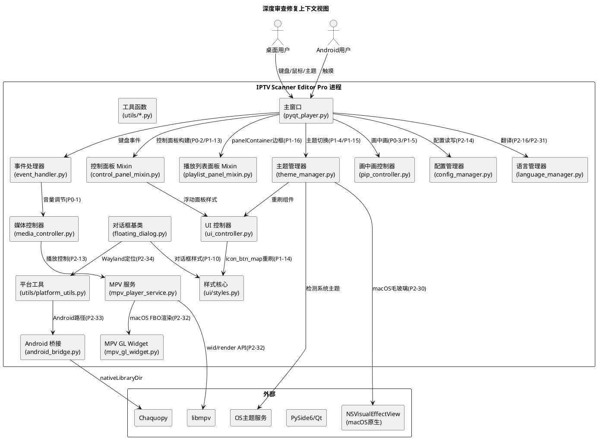
```plantuml
@startuml context
title 深度审查修复上下文视图
skinparam componentStyle rectangle

actor "桌面用户" as user
actor "Android用户" as au

rectangle "IPTV Scanner Editor Pro 进程" {
  component "主窗口\n(pyqt_player.py)" as MW
  component "事件处理器\n(event_handler.py)" as EH
  component "控制面板 Mixin\n(control_panel_mixin.py)" as CPM
  component "播放列表面板 Mixin\n(playlist_panel_mixin.py)" as PPM
  component "UI 控制器\n(ui_controller.py)" as UIC
  component "主题管理器\n(theme_manager.py)" as TM
  component "画中画控制器\n(pip_controller.py)" as PIP
  component "媒体控制器\n(media_controller.py)" as MC
  component "MPV 服务\n(mpv_player_service.py)" as MPV
  component "MPV GL Widget\n(mpv_gl_widget.py)" as GLW
  component "配置管理器\n(config_manager.py)" as CM
  component "语言管理器\n(language_manager.py)" as LM
  component "样式核心\n(ui/styles.py)" as STY
  component "对话框基类\n(floating_dialog.py)" as FD
  component "平台工具\n(utils/platform_utils.py)" as PU
  component "工具函数\n(utils/*.py)" as UT
  component "Android 桥接\n(android_bridge.py)" as AB
}

rectangle "外部" {
  component "libmpv" as LIB
  component "PySide6/Qt" as QT
  component "OS主题服务" as OS
  component "Chaquopy" as CHQ
  component "NSVisualEffectView\n(macOS原生)" as NSV
}

user --> MW : 键盘/鼠标/主题
au --> MW : 触摸
MW --> EH : 键盘事件
EH --> MC : 音量调节(P0-1)
MW --> CPM : 控制面板构建(P0-2/P1-13)
MW --> PPM : panelContainer边框(P1-16)
CPM --> UIC : 浮动面板样式
UIC --> STY : icon_btn_map重刷(P1-14)
MW --> TM : 主题切换(P1-4/P1-15)
TM --> UIC : 重刷组件
TM --> OS : 检测系统主题
TM --> NSV : macOS毛玻璃(P2-30)
MW --> PIP : 画中画(P0-3/P1-5)
MC --> MPV : 播放控制(P2-13)
MPV --> LIB : wid/render API(P2-32)
MPV --> GLW : macOS FBO渲染(P2-32)
MW --> CM : 配置读写(P2-14)
MW --> LM : 翻译(P2-16/P2-31)
FD --> STY : 对话框样式(P1-10)
FD --> PU : Wayland定位(P2-34)
PU --> AB : Android路径(P2-33)
AB --> CHQ : nativeLibraryDir
@enduml
```

通信协议：进程内 Qt 信号槽（同步/异步）、直接方法调用。macOS 毛玻璃通过 PyObjC/ctypes 调用 Cocoa API（进程内）。无新增中间件。

### 2.1.2 服务/组件总体架构

修复后总体架构保持现有分层，仅在 P2-13~P2-16 拆分处新增子模块，P2-30~P2-34 跨平台处增强平台适配层：

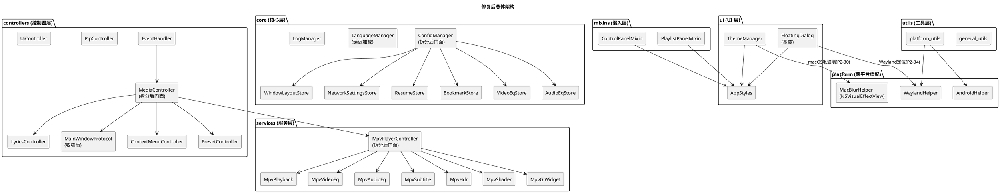
```plantuml
@startuml arch
title 修复后总体架构
skinparam componentStyle rectangle

package "controllers (控制器层)" {
  component "EventHandler" as EH
  component "MediaController\n(拆分后门面)" as MC
  component "ContextMenuController" as CMC
  component "PresetController" as PC
  component "LyricsController" as LC
  component "PipController" as PIP
  component "UiController" as UIC
  component "MainWindowProtocol\n(收窄后)" as MWP
}

package "services (服务层)" {
  component "MpvPlayerController\n(拆分后门面)" as MPV
  component "MpvPlayback" as MPB
  component "MpvVideoEq" as MVE
  component "MpvAudioEq" as MAE
  component "MpvSubtitle" as MSU
  component "MpvHdr" as MHD
  component "MpvShader" as MSH
  component "MpvGlWidget" as GLW
}

package "core (核心层)" {
  component "ConfigManager\n(拆分后门面)" as CM
  component "WindowLayoutStore" as WLS
  component "NetworkSettingsStore" as NSS
  component "ResumeStore" as RS
  component "BookmarkStore" as BS
  component "VideoEqStore" as VES
  component "AudioEqStore" as AES
  component "LanguageManager\n(延迟加载)" as LM
  component "LogManager" as LGM
}

package "ui (UI 层)" {
  component "ThemeManager" as TM
  component "AppStyles" as STY
  component "FloatingDialog\n(基类)" as FD
}

package "mixins (混入层)" {
  component "ControlPanelMixin" as CPM
  component "PlaylistPanelMixin" as PPM
}

package "utils (工具层)" {
  component "general_utils" as GU
  component "platform_utils" as PU
}

package "platform (跨平台适配)" {
  component "MacBlurHelper\n(NSVisualEffectView)" as MBH
  component "WaylandHelper" as WH
  component "AndroidHelper" as AH
}

EH --> MC
MC --> CMC
MC --> PC
MC --> LC
MC --> MPV
MPV --> MPB
MPV --> MVE
MPV --> MAE
MPV --> MSU
MPV --> MHD
MPV --> MSH
MPV --> GLW
MC --> MWP
CM --> WLS
CM --> NSS
CM --> RS
CM --> BS
CM --> VES
CM --> AES
TM --> STY
TM --> MBH : macOS毛玻璃(P2-30)
FD --> STY
FD --> WH : Wayland定位(P2-34)
CPM --> STY
PPM --> STY
PU --> WH
PU --> AH
@enduml
```

模块划分及职责：
- **controllers**：事件分发、业务编排，拆分后 MediaController 仅作门面委托子控制器
- **services**：MPV 播放器封装，拆分后 MpvPlayerController 仅作门面委托子控制器；MpvGlWidget 负责 macOS render API FBO 渲染
- **core**：配置/语言/日志，拆分后 ConfigManager 仅作统一入口委托域存储；LanguageManager 改延迟加载
- **ui**：主题/样式/对话框基类，FloatingDialog 提供 `_extra_theme_css()` 钩子；ThemeManager 委托 MacBlurHelper 实现毛玻璃
- **mixins**：控制面板/播放列表面板构建，清理冗余按钮后职责更聚焦；panelContainer 创建时声明 border:none
- **utils**：纯函数工具，清理死函数后更精简
- **platform**：跨平台适配层，MacBlurHelper 封装 NSVisualEffectView，WaylandHelper 封装定位/调整，AndroidHelper 封装触摸尺寸/libmpv 路径

配置项及取值策略：
- `PROGRAM_DESC_HEIGHT`：移除固定值，改用 `setMaximumHeight(48)` + CSS `max-height: 48px`
- `DelayMs` 常量：`UI_REFRESH=50`、`LAYOUT_SETTLE=100`、`STYLE_REAPPLY=200`、`DEFERRED_INIT=150`、`VOLUME_HOLD=300`、`OSD_FADE=500`
- `TOUCH_TARGET_DESKTOP=32`、`TOUCH_TARGET_ANDROID=48`：触摸目标尺寸按平台区分

### 2.1.3 实现设计文档

#### 2.1.3.1 P0-3 PiP 按钮 pixmap 缓存流程（最高优先级）

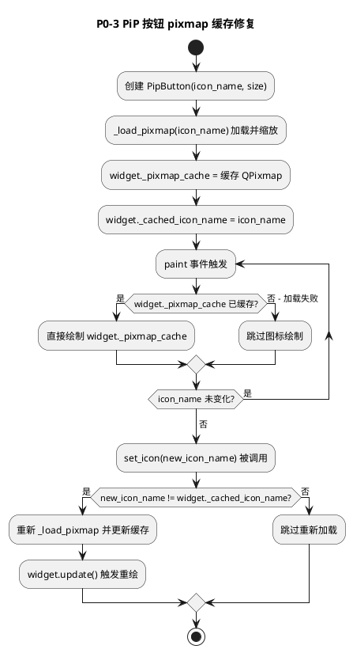
```plantuml
@startuml p0_3
title P0-3 PiP 按钮 pixmap 缓存修复
start
:创建 PipButton(icon_name, size);
:_load_pixmap(icon_name) 加载并缩放;
:widget._pixmap_cache = 缓存 QPixmap;
:widget._cached_icon_name = icon_name;
repeat :paint 事件触发
  if (widget._pixmap_cache 已缓存?) then (是)
    :直接绘制 widget._pixmap_cache;
  else (否 - 加载失败)
    :跳过图标绘制;
  endif
repeat while (icon_name 未变化?) is (是)
->否;
:set_icon(new_icon_name) 被调用;
if (new_icon_name != widget._cached_icon_name?) then (是)
  :重新 _load_pixmap 并更新缓存;
  :widget.update() 触发重绘;
else (否)
  :跳过重新加载;
endif
stop
@enduml
```

触发条件：画中画模式下 PiP 按钮重绘（hover/leave/视频帧更新）。处理策略：pixmap 在创建时缓存，paint 事件仅绘制缓存，set_icon 改变 icon_name 时才重新加载。修复后 paint 事件不再调用 `QPixmap(path)`/`scaled`，消除卡顿花屏根因。

#### 2.1.3.2 P0-1 音量快捷键修复流程

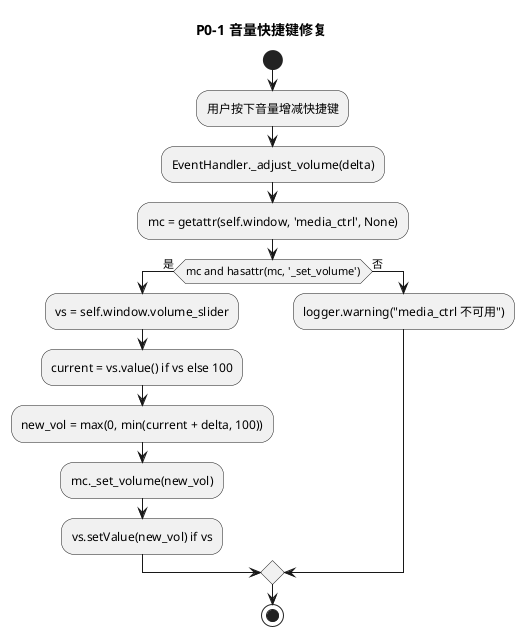
```plantuml
@startuml p0_1
title P0-1 音量快捷键修复
start
:用户按下音量增减快捷键;
:EventHandler._adjust_volume(delta);
:mc = getattr(self.window, 'media_ctrl', None);
if (mc and hasattr(mc, '_set_volume')) then (是)
  :vs = self.window.volume_slider;
  :current = vs.value() if vs else 100;
  :new_vol = max(0, min(current + delta, 100));
  :mc._set_volume(new_vol);
  :vs.setValue(new_vol) if vs;
else (否)
  :logger.warning("media_ctrl 不可用");
endif
stop
@enduml
```

触发条件：键盘音量增减快捷键。处理策略：修正属性名后委托 MediaController._set_volume。

#### 2.1.3.3 P0-2/P1-13 控制面板冗余按钮清理流程

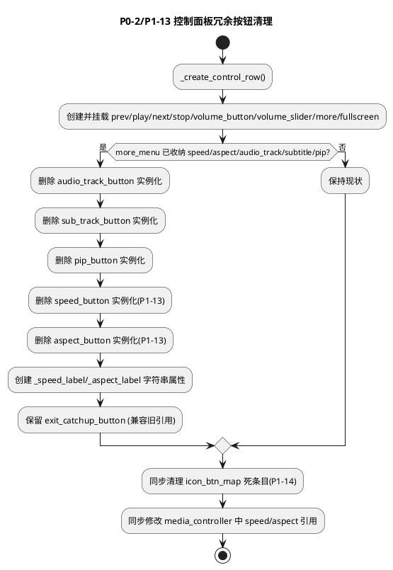
```plantuml
@startuml p0_2
title P0-2/P1-13 控制面板冗余按钮清理
start
:_create_control_row();
:创建并挂载 prev/play/next/stop/volume_button/volume_slider/more/fullscreen;
if (more_menu 已收纳 speed/aspect/audio_track/subtitle/pip?) then (是)
  :删除 audio_track_button 实例化;
  :删除 sub_track_button 实例化;
  :删除 pip_button 实例化;
  :删除 speed_button 实例化(P1-13);
  :删除 aspect_button 实例化(P1-13);
  :创建 _speed_label/_aspect_label 字符串属性;
  :保留 exit_catchup_button (兼容旧引用);
else (否)
  :保持现状;
endif
:同步清理 icon_btn_map 死条目(P1-14);
:同步修改 media_controller 中 speed/aspect 引用;
stop
@enduml
```

触发条件：控制面板构建。处理策略：删除冗余实例化，状态载体改为字符串属性；同步清理 icon_btn_map 和 media_controller 引用。

#### 2.1.3.4 P1-15/16/17 嵌套容器边框单一化流程

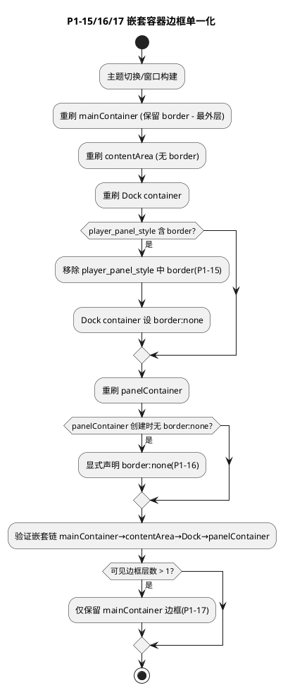
```plantuml
@startuml p1_15
title P1-15/16/17 嵌套容器边框单一化
start
:主题切换/窗口构建;
:重刷 mainContainer (保留 border - 最外层);
:重刷 contentArea (无 border);
:重刷 Dock container;
if (player_panel_style 含 border?) then (是)
  :移除 player_panel_style 中 border(P1-15);
  :Dock container 设 border:none;
endif
:重刷 panelContainer;
if (panelContainer 创建时无 border:none?) then (是)
  :显式声明 border:none(P1-16);
endif
:验证嵌套链 mainContainer→contentArea→Dock→panelContainer;
if (可见边框层数 > 1?) then (是)
  :仅保留 mainContainer 边框(P1-17);
endif
stop
@enduml
```

触发条件：主题切换或窗口构建。处理策略：整条嵌套链只保留最外层 mainContainer 一处边框，Dock container/panelContainer 均设 border:none。扩展点：player_panel_style 中 border 移除后，neumorphic/mac/ios 等无边框主题不受影响。

#### 2.1.3.5 P1-10 对话框 DRY 重构状态流转

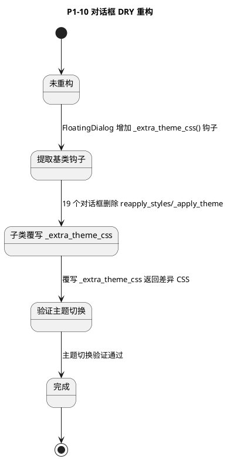
```plantuml
@startuml p1_10
title P1-10 对话框 DRY 重构
state "未重构" as unre
state "提取基类钩子" as base
state "子类覆写 _extra_theme_css" as sub
state "验证主题切换" as verify
state "完成" as done

[*] --> unre
unre --> base : FloatingDialog 增加 _extra_theme_css() 钩子
base --> sub : 19 个对话框删除 reapply_styles/_apply_theme
sub --> verify : 覆写 _extra_theme_css 返回差异 CSS
verify --> done : 主题切换验证通过
done --> [*]
@enduml
```

扩展点：`FloatingDialog._extra_theme_css()` 钩子，默认实现返回空字符串，子类覆写返回差异 CSS。

#### 2.1.3.6 P2-30 macOS 毛玻璃实现流程

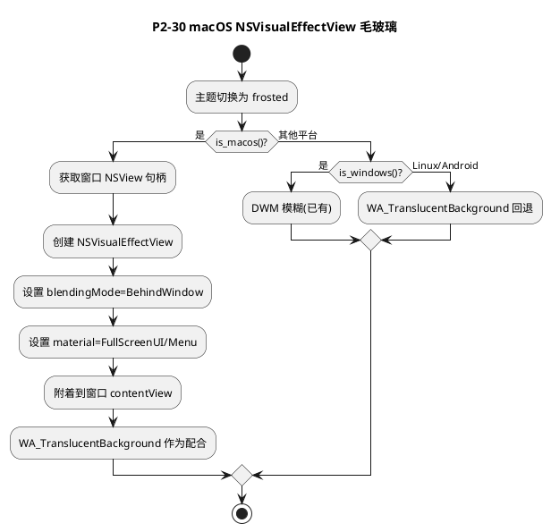
```plantuml
@startuml p2_30
title P2-30 macOS NSVisualEffectView 毛玻璃
start
:主题切换为 frosted;
if (is_macos()?) then (是)
  :获取窗口 NSView 句柄;
  :创建 NSVisualEffectView;
  :设置 blendingMode=BehindWindow;
  :设置 material=FullScreenUI/Menu;
  :附着到窗口 contentView;
  :WA_TranslucentBackground 作为配合;
else (其他平台)
  if (is_windows()?) then (是)
    :DWM 模糊(已有);
  else (Linux/Android)
    :WA_TranslucentBackground 回退;
  endif
endif
stop
@enduml
```

触发条件：macOS + frosted 主题。处理策略：通过 PyObjC/ctypes 调用 NSVisualEffectView 实现原生毛玻璃；非 macOS 回退 WA_TranslucentBackground。异常场景：NSView 句柄获取失败时回退 WA_TranslucentBackground 并记录 warning。

#### 2.1.3.7 P2-31 翻译延迟加载流程

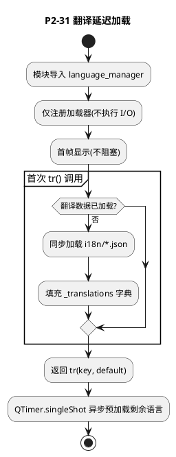
```plantuml
@startuml p2_31
title P2-31 翻译延迟加载
start
:模块导入 language_manager;
:仅注册加载器(不执行 I/O);
:首帧显示(不阻塞);
partition "首次 tr() 调用" {
  if (翻译数据已加载?) then (否)
    :同步加载 i18n/*.json;
    :填充 _translations 字典;
  endif
}
:返回 tr(key, default);
:QTimer.singleShot 异步预加载剩余语言;
stop
@enduml
```

触发条件：应用启动。处理策略：模块导入仅注册懒加载代理，首次 tr() 调用时才加载 JSON；或首帧后 QTimer.singleShot 异步预加载。异常场景：JSON 加载失败时回退内置最小翻译。

#### 2.1.3.8 P2-34 Wayland 浮动 Dock 定位流程

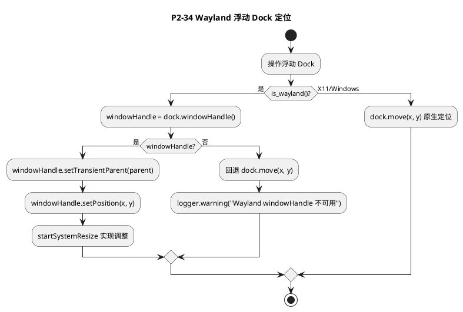
```plantuml
@startuml p2_34
title P2-34 Wayland 浮动 Dock 定位
start
:操作浮动 Dock;
if (is_wayland()?) then (是)
  :windowHandle = dock.windowHandle();
  if (windowHandle?) then (是)
    :windowHandle.setTransientParent(parent);
    :windowHandle.setPosition(x, y);
    :startSystemResize 实现调整;
  else (否)
    :回退 dock.move(x, y);
    :logger.warning("Wayland windowHandle 不可用");
  endif
else (X11/Windows)
  :dock.move(x, y) 原生定位;
endif
stop
@enduml
```

触发条件：Wayland 下操作浮动 Dock。处理策略：通过 windowHandle.setPosition/startSystemResize 实现定位/调整；windowHandle 为 None 时回退 widget.move。异常场景：setPosition 失败时回退并记录日志。

#### 2.1.3.9 P2-13 MpvPlayerController 拆分事务设计

拆分涉及数据一致性：mpv 实例（`self._mpv`）为共享资源，子控制器需通过门面访问 mpv 实例，避免多子控制器并发操作 mpv 属性。

事务边界：所有 mpv 属性读写仍通过 `MpvPlayerController._set_mpv_string`/`_get_mpv_property_*` 系列方法，子控制器调用门面方法而非直接操作 mpv 实例。这保证 mpv 操作的线程安全边界不变。

## 2.2 接口设计

设计原则：
- 接口参数类型安全，使用 PySide6/typing 提供的精确类型，禁用 `Any`（除 Qt 事件对象外）
- 接口粒度适中，门面方法委托子控制器，不暴露子控制器实例
- 接口版本管理：本次为内部重构，不改变对外公开 API 签名，仅改变内部实现

### 2.2.1 总体设计

接口分类依据：
- **修复类接口**：单点修改现有方法实现，不改变签名
- **新增类接口**：拆分后新增子控制器/域存储/平台适配器的构造与方法
- **删除类接口**：删除死方法/死函数/冗余按钮/死条目

接口变更策略：内部重构保持外部 API 兼容，避免上游调用方修改。

| 接口分类 | 接口名 | 类型 | 稳定性 |
|---------|--------|------|--------|
| 修复 | `EventHandler._adjust_volume(delta)` | 方法实现修改 | 稳定 |
| 修复 | `ControlPanelMixin._create_control_row()` | 方法实现修改 | 稳定 |
| 修复 | `PipButton.__init__` / `paint_event` / `set_icon` | pixmap 缓存改造 | 稳定 |
| 修复 | `IPTVPlayer._create_info_row()` | 方法实现修改 | 稳定 |
| 修复 | `ThemeManager._reapply_main_window_components(window)` | 方法实现修改 | 稳定 |
| 修复 | `AppStyles.player_panel_style()` | 移除 border | 稳定 |
| 修复 | `PlaylistPanelMixin`/`ControlPanelMixin` panelContainer 创建 | 增加 border:none | 稳定 |
| 修复 | `PipController._create_button` / `_update_play_btn` | 方法实现修改 | 稳定 |
| 修复 | `AppStyles.player_program_desc_style()` | 方法实现修改 | 稳定 |
| 修复 | `AppStyles._style_menu_decoration(colors)` | 方法实现修改 | 稳定 |
| 修复 | `UIController._reapply_floating_panel_styles()` icon_btn_map | 删除死条目 | 稳定 |
| 修复 | `LanguageManager` 模块级 I/O | 改延迟加载 | 稳定 |
| 修复 | `MpvPlayerService` vo/gpu-context 配置 | 补全平台分支 | 稳定 |
| 新增 | `AppStyles.status_channel_label_style()` | 新增静态方法 | 稳定 |
| 新增 | `UIController._truncate_to_lines(text, max_lines)` | 新增静态方法 | 稳定 |
| 新增 | `FloatingDialog._extra_theme_css()` | 新增钩子方法 | 稳定 |
| 新增 | `DelayMs` 常量类 | 新增常量类 | 稳定 |
| 新增 | `MacBlurHelper.apply(window)` / `remove(window)` | 新增平台适配器 | 实验 |
| 新增 | `MpvPlayback`/`MpvVideoEq`/`MpvAudioEq`/`MpvSubtitle`/`MpvHdr`/`MpvShader` | 新增子控制器 | 实验 |
| 新增 | `WindowLayoutStore`/`NetworkSettingsStore`/`ResumeStore`/`BookmarkStore`/`VideoEqStore`/`AudioEqStore` | 新增域存储 | 实验 |
| 新增 | `ContextMenuController`/`PresetController`/`LyricsController` | 新增子控制器 | 实验 |
| 新增 | `i18n/zh.json`/`i18n/en.json` | 新增资源文件 | 稳定 |
| 新增 | `PlaybackProtocol`/`ChannelProtocol`/`EpgProtocol`/`UiProtocol` | 新增窄协议 | 实验 |
| 删除 | `ThemeManager._is_windows()` | 删除死方法 | 废弃 |
| 删除 | `platform_utils.is_mobile()` | 删除死函数 | 废弃 |
| 删除 | `bookmark_controller._format_time()` | 删除重复函数 | 废弃 |
| 删除 | `resume_playback_controller._format_time()` | 删除重复函数 | 废弃 |
| 删除 | `floating_dialog._parse_hex_color()` | 删除重复函数 | 废弃 |
| 删除 | icon_btn_map 中 audio_track_button/sub_track_button/pip_button 条目 | 删除死条目 | 废弃 |

### 2.2.2 接口清单

#### PipButton pixmap 缓存（P0-3）

```python
class PipButton:
    def __init__(self, icon_name: str, size: int, parent: QWidget, click_callback: Callable[[], None]) -> None: ...
    def set_icon(self, icon_name: str) -> None: ...
    # 内部：widget._pixmap_cache: QPixmap，widget._cached_icon_name: str
```
- **业务说明**：画中画圆形按钮，pixmap 在创建时缓存，paint 事件仅绘制缓存
- **前置条件**：icon_name 为合法图标名，size > 0
- **后置条件**：`widget._pixmap_cache` 持有缩放后的 QPixmap；paint 事件不调用 `_load_pixmap`
- **异常映射**：图标加载失败时缓存空 QPixmap，paint 事件跳过绘制，不抛异常
- **调用示例**：`btn = PipButton('play', 40, parent, on_click)`；`btn.set_icon('pause')` 仅在 icon_name 变化时重新加载

#### EventHandler._adjust_volume

```python
def _adjust_volume(self, delta: int) -> None:
```
- **业务说明**：键盘音量增减快捷键处理，委托 MediaController._set_volume
- **前置条件**：`self.window.media_ctrl` 已初始化且具有 `_set_volume` 方法
- **后置条件**：音量值更新为 `max(0, min(current + delta, 100))`，volume_slider 同步
- **异常映射**：media_ctrl 不可用时记录 warning 日志，不抛异常
- **调用示例**：`self.event_handler._adjust_volume(5)  # 音量+5`

#### UIController._truncate_to_lines

```python
@staticmethod
def _truncate_to_lines(text: str, max_lines: int = 3) -> str:
```
- **业务说明**：将文本截断为最多 max_lines 行，超出部分以 "..." 标识
- **前置条件**：text 为字符串（可为空）
- **后置条件**：返回字符串行数 <= max_lines（含 "..." 行）
- **异常映射**：text 为 None 时返回空字符串
- **调用示例**：`desc = UIController._truncate_to_lines(long_text, 3)`

#### FloatingDialog._extra_theme_css

```python
def _extra_theme_css(self) -> str:
```
- **业务说明**：对话框主题差异 CSS 钩子，子类覆写返回独有样式
- **前置条件**：对话框已初始化
- **后置条件**：返回合法 CSS 字符串（可为空）
- **异常映射**：默认实现返回 ""，子类不应抛异常
- **调用示例**：
```python
class BookmarkDialog(FloatingDialog):
    def _extra_theme_css(self) -> str:
        return "QListWidget { border-radius: 6px; }"
```

#### AppStyles.status_channel_label_style

```python
@classmethod
def status_channel_label_style(cls) -> str:
```
- **业务说明**：状态栏频道标签样式，包含 color 和 padding
- **前置条件**：无
- **后置条件**：返回包含 `color` 和 `padding: 0 8px` 的 CSS 字符串
- **异常映射**：无
- **调用示例**：`self._status_channel_label.setStyleSheet(AppStyles.status_channel_label_style())`

#### AppStyles.player_panel_style（P1-15 修改）

```python
@classmethod
def player_panel_style(cls) -> str:
```
- **业务说明**：Dock 容器样式，移除 border 以避免与 mainContainer 边框叠加
- **前置条件**：无
- **后置条件**：返回不含 `border` 的 CSS 字符串（边框由 mainContainer 统一持有）
- **异常映射**：无
- **调用示例**：`container.setStyleSheet(AppStyles.player_panel_style())`

#### MacBlurHelper（P2-30 新增）

```python
class MacBlurHelper:
    @staticmethod
    def apply(window: QWidget, material: str = "menu") -> bool: ...
    @staticmethod
    def remove(window: QWidget) -> None: ...
```
- **业务说明**：macOS 原生毛玻璃模糊，通过 NSVisualEffectView 附着到 Qt 窗口
- **前置条件**：运行于 macOS，window 已有有效 NSView 句柄
- **后置条件**：窗口显示毛玻璃模糊效果；返回 True 表示成功
- **异常映射**：NSView 句柄获取失败返回 False，调用方回退 WA_TranslucentBackground
- **调用示例**：`if is_macos() and not MacBlurHelper.apply(self): self.setAttribute(WA_TranslucentBackground)`

#### LanguageManager 延迟加载（P2-31 修改）

```python
class LanguageManager:
    def tr(self, key: str, default: str = "") -> str: ...
    def _ensure_loaded(self) -> None: ...  # 首次调用时加载 JSON
```
- **业务说明**：翻译查询，模块导入不执行 I/O，首次 tr() 触发加载
- **前置条件**：无
- **后置条件**：首次调用后 `_translations` 字典填充；后续调用直接查字典
- **异常映射**：JSON 加载失败时回退内置最小翻译，记录 error
- **调用示例**：`text = lang_manager.tr("panel_play", "播放")`

#### DelayMs 常量类

```python
class DelayMs:
    UI_REFRESH = 50
    LAYOUT_SETTLE = 100
    STYLE_REAPPLY = 200
    DEFERRED_INIT = 150
    VOLUME_HOLD = 300
    OSD_FADE = 500
    SPLASH_DISMISS = 800
```
- **业务说明**：QTimer.singleShot 延迟值常量集中定义
- **前置条件**：无
- **后置条件**：无
- **调用示例**：`QTimer.singleShot(DelayMs.UI_REFRESH, self._refresh)`

#### MpvPlayback（拆分后子控制器，示意）

```python
class MpvPlayback:
    def __init__(self, mpv_facade: 'MpvPlayerController') -> None: ...
    def play(self, url: str, channel_name: str | None = None, program_duration: int = 0) -> bool: ...
    def stop(self) -> None: ...
    def pause(self) -> None: ...
    def seek_absolute(self, target_seconds: float) -> None: ...
```
- **业务说明**：MPV 播放控制子控制器，封装 play/stop/pause/seek 等基础播放操作
- **前置条件**：mpv_facade 已完成 mpv 实例化
- **后置条件**：mpv 实例状态变更
- **异常映射**：mpv 操作失败时通过 facade._safe_emit 发射错误信号
- **调用示例**：`self.playback.play(url, channel_name)`

#### WindowLayoutStore（拆分后域存储，示意）

```python
class WindowLayoutStore:
    def __init__(self, config_parser: configparser.ConfigParser) -> None: ...
    def get_window_geometry(self) -> tuple[int, int, int, int]: ...
    def set_window_geometry(self, x: int, y: int, w: int, h: int) -> None: ...
    def get_panel_visibility(self) -> dict[str, bool]: ...
    def set_panel_visibility(self, visibility: dict[str, bool]) -> None: ...
```
- **业务说明**：窗口布局配置域存储，封装窗口几何/面板可见性读写
- **前置条件**：config_parser 已加载 config.ini
- **后置条件**：config.ini 中 `window_*` 配置项更新
- **异常映射**：配置读写失败时记录 error 日志，返回默认值
- **调用示例**：`x, y, w, h = self.window_layout.get_window_geometry()`

## 2.3 数据模型

### 2.3.1 设计目标

数据模型设计目标：
- 支持配置域拆分后的独立读写，避免 ConfigManager 单点瓶颈
- 支持翻译数据外置后的增量/延迟加载，降低启动阻塞
- 支持子控制器拆分后的状态隔离，避免共享状态竞争
- 支持 PipButton pixmap 缓存，避免 paint 事件重复加载
- 与存量数据兼容：config.ini 格式不变，翻译 key 不变，仅存储位置变更

性能、容量、扩展性目标：
- 翻译数据外置后启动加载时间 < 50ms（JSON 解析），且不阻塞首帧
- 子控制器拆分后 mpv 属性读写延迟不变（仍通过门面方法）
- 域存储拆分后配置读写线程安全由 configparser 全局锁保证
- PipButton pixmap 缓存后 paint 事件开销从 O(文件加载+缩放) 降为 O(绘制)

与存量数据兼容策略：
- config.ini：保持现有 section/key 结构，域存储仅作读写入口拆分，不改变文件格式
- 翻译数据：BUILTIN_TRANSLATIONS 字典内容原样迁移到 i18n/zh.json、i18n/en.json，key 不变
- 运行时状态：子控制器拆分后状态仍归 MpvPlayerController 持有，子控制器通过门面访问
- PipButton 缓存：_pixmap_cache 生命周期与 widget 一致，widget 销毁时缓存自动释放

### 2.3.2 模型实现

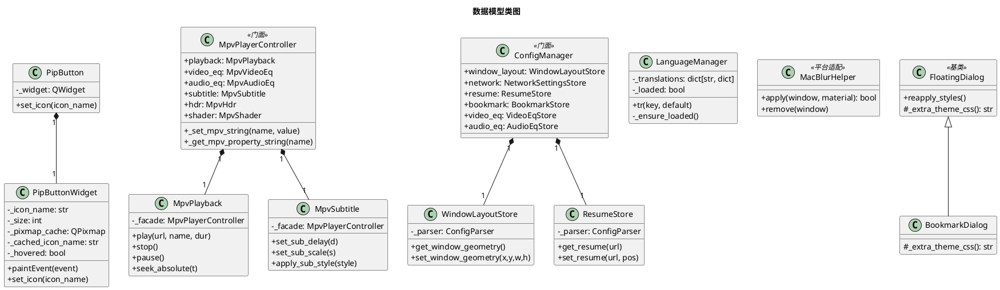
```plantuml
@startuml model
title 数据模型类图
skinparam classAttributeIconSize 0

class PipButton {
  - _widget: QWidget
  + set_icon(icon_name)
}

class PipButtonWidget {
  - _icon_name: str
  - _size: int
  - _pixmap_cache: QPixmap
  - _cached_icon_name: str
  - _hovered: bool
  + paintEvent(event)
  + set_icon(icon_name)
}

class MpvPlayerController <<门面>> {
  + playback: MpvPlayback
  + video_eq: MpvVideoEq
  + audio_eq: MpvAudioEq
  + subtitle: MpvSubtitle
  + hdr: MpvHdr
  + shader: MpvShader
  + _set_mpv_string(name, value)
  + _get_mpv_property_string(name)
}

class MpvPlayback {
  - _facade: MpvPlayerController
  + play(url, name, dur)
  + stop()
  + pause()
  + seek_absolute(t)
}

class MpvSubtitle {
  - _facade: MpvPlayerController
  + set_sub_delay(d)
  + set_sub_scale(s)
  + apply_sub_style(style)
}

class ConfigManager <<门面>> {
  + window_layout: WindowLayoutStore
  + network: NetworkSettingsStore
  + resume: ResumeStore
  + bookmark: BookmarkStore
  + video_eq: VideoEqStore
  + audio_eq: AudioEqStore
}

class WindowLayoutStore {
  - _parser: ConfigParser
  + get_window_geometry()
  + set_window_geometry(x,y,w,h)
}

class ResumeStore {
  - _parser: ConfigParser
  + get_resume(url)
  + set_resume(url, pos)
}

class LanguageManager {
  - _translations: dict[str, dict]
  - _loaded: bool
  + tr(key, default)
  - _ensure_loaded()
}

class MacBlurHelper <<平台适配>> {
  + apply(window, material): bool
  + remove(window)
}

class FloatingDialog <<基类>> {
  + reapply_styles()
  # _extra_theme_css(): str
}

class BookmarkDialog {
  # _extra_theme_css(): str
}

PipButton "1" *-- "1" PipButtonWidget
MpvPlayerController "1" *-- "1" MpvPlayback
MpvPlayerController "1" *-- "1" MpvSubtitle
ConfigManager "1" *-- "1" WindowLayoutStore
ConfigManager "1" *-- "1" ResumeStore
FloatingDialog <|-- BookmarkDialog
@enduml
```

对象创建和销毁策略：
- PipButton 缓存：widget 创建时加载 pixmap 到 `_pixmap_cache`，widget 销毁时 QPixmap 自动释放；set_icon 改变 icon_name 时替换缓存
- 子控制器：MpvPlayerController 构造时创建，随门面销毁；不独立持有 mpv 实例
- 域存储：ConfigManager 构造时创建，共享同一 ConfigParser 实例；ConfigManager 销毁时统一 flush
- 翻译数据：LanguageManager 首次 tr() 调用时从 JSON 加载到内存字典，运行时只读
- MacBlurHelper：静态方法，不持有状态；NSVisualEffectView 生命周期跟随窗口
- 对话框：按需创建，关闭时销毁；FloatingDialog 基类不持有子类状态

持久化策略：
- config.ini：ConfigParser 原子写入（写入临时文件后 rename），域存储不直接持久化
- i18n/*.json：只读资源，不持久化；用户自定义翻译仍走 config.ini 的 `[translations]` section
- 运行时状态：子控制器状态不持久化，仅 mpv 自身属性在播放时由 mpv 维护
- PipButton pixmap 缓存：不持久化，进程内内存
# 三、实现步骤

按优先级分四批落地，每批内按依赖顺序执行。P0-3 播放卡顿花屏回归为第一批最高优先级，需最先修复。

## 3.1 第一批：P0+P1 立即修复（单点修改为主）

| 步骤 | 问题编号 | 修改内容 | 修改位置 | 预计工时 |
|------|---------|---------|---------|---------|
| 1 | P0-3 | PipButton `__init__` 加载并缓存 pixmap 到 `widget._pixmap_cache`；paint 事件改用缓存；set_icon 仅 icon_name 变化时重新加载 | controllers/pip_controller.py:33-76 | 20min |
| 2 | P0-1 | `update_ctrl` → `media_ctrl` | controllers/event_handler.py:21 | 5min |
| 3 | P0-2/P1-13 | 删除 audio_track/sub_track/pip/speed/aspect_button 实例化；创建 `_speed_label`/`_aspect_label` 字符串属性；保留 exit_catchup_button | mixins/control_panel_mixin.py:320-335 | 25min |
| 4 | P1-14 | icon_btn_map 删除 audio_track_button/sub_track_button/pip_button/speed_button/aspect_button 死条目；同步修改 media_controller 中 speed/aspect 引用 | controllers/ui_controller.py:1054-1064、controllers/media_controller.py 多处 | 30min |
| 5 | P1-15 | player_panel_style 移除 border；Dock container 设 border:none | ui/styles.py:2561、ui/theme_manager.py:234、controllers/ui_controller.py:500 | 20min |
| 6 | P1-16 | panelContainer 创建时显式声明 `border:none` | mixins/control_panel_mixin.py:27、mixins/playlist_panel_mixin.py:28,136 | 10min |
| 7 | P1-17 | 验证嵌套链 mainContainer→contentArea→Dock→panelContainer 最多一层可见边框 | pyqt_player.py:596/607、ui/styles.py:1595 | 15min |
| 8 | P1-3 | 移除 `setFixedHeight(54)`，改 `setMaximumHeight(48)` + CSS max-height；移除重复背景设置 | pyqt_player.py:218、mixins/control_panel_mixin.py:210、ui/styles.py player_program_desc_style | 30min |
| 9 | P1-4 | `_reapply_main_window_components()` 增加调用 `_reapply_floating_panel_styles()` 重刷控制面板图标 | ui/theme_manager.py:212 | 15min |
| 10 | P1-5 | `_create_button` 改用 `AppStyles.get_icon()` 生成 SVG；`_update_play_btn` 改图标切换 | controllers/pip_controller.py:332-373 | 30min |
| 11 | P1-6 | 提取 `AppStyles.status_channel_label_style()`；替换内联样式 | ui/styles.py、pyqt_player.py:826 | 15min |
| 12 | P1-7 | 删除 `theme_manager._is_windows()` | ui/theme_manager.py:209-210 | 2min |
| 13 | P1-8 | 删除 `platform_utils.is_mobile()` | utils/platform_utils.py:73 | 2min |
| 14 | P1-9 | 删除 bookmark_controller/resume_playback_controller 的 `_format_time`，改调 `general_utils.format_time` | controllers/bookmark_controller.py:63、controllers/resume_playback_controller.py:190 | 10min |
| 15 | P1-10 | FloatingDialog 增加 `_extra_theme_css()` 钩子；19 个对话框删除 reapply_styles/_apply_theme，覆写钩子 | ui/floating_dialog.py、ui/dialogs/*.py | 2h |
| 16 | P1-11 | 删除 `floating_dialog._parse_hex_color`，改调 `color_to_qcolor` | ui/floating_dialog.py:25 | 15min |
| 17 | P1-12 | 删除 22+ 处"开始/完成"配对调试日志 | pyqt_player.py、mixins/control_panel_mixin.py | 30min |

第一批完成后需进行：P0-3 画中画模式播放卡顿验证、键盘音量快捷键回归测试、控制面板布局视觉验证、主题切换边框叠加验证（四端）、主题切换全量验证。

## 3.2 第二批：P2 架构重构（结构性变更）

| 步骤 | 问题编号 | 修改内容 | 修改位置 | 预计工时 |
|------|---------|---------|---------|---------|
| 18 | P2-13 | MpvPlayerController 拆分为门面 + 7 子控制器；保持对外 API 兼容 | services/mpv_player_service.py、新增 services/mpv_*.py | 2-3d |
| 19 | P2-14 | ConfigManager 拆分为门面 + 6 域存储；保持对外 API 兼容 | core/config_manager.py、新增 core/stores/*.py | 1-2d |
| 20 | P2-15 | MediaController 拆分为门面 + 3 子控制器；保持对外 API 兼容 | controllers/media_controller.py、新增 controllers/*_controller.py | 1-2d |
| 21 | P2-16 | BUILTIN_TRANSLATIONS 迁移到 i18n/zh.json、i18n/en.json；LanguageManager 改 JSON 加载 | core/language_manager.py、新增 i18n/*.json | 4h |
| 22 | P2-22 | MainWindowProtocol 拆分为 4 窄协议；控制器改依赖窄协议 | controllers/main_window_protocol.py、各控制器 | 1d |

第二批每步完成后需进行：全功能回归测试（播放/配置/菜单/对话框），确保对外 API 兼容。

## 3.3 第三批：P2 跨平台兼容（平台特定修改）

| 步骤 | 问题编号 | 修改内容 | 修改位置 | 预计工时 |
|------|---------|---------|---------|---------|
| 23 | P2-30 | 新增 MacBlurHelper（NSVisualEffectView）；theme_manager frosted 主题委托 MacBlurHelper；失败回退 WA_TranslucentBackground | 新增 platform/mac_blur_helper.py、ui/theme_manager.py:109-136、ui/floating_dialog.py | 4h |
| 24 | P2-31 | language_manager 模块级 I/O 改延迟加载：模块导入仅注册加载器，首次 tr() 触发加载；或 QTimer.singleShot 异步预加载 | core/language_manager.py | 2h |
| 25 | P2-32 | 审查并补全四端 vo/gpu-context 配置：Windows(d3d11/vulkan)、macOS(libmpv render API)、Linux(gpu-next+x11egl+WA_NativeWindow+WA_DontCreateNativeAncestors)、Android(默认) | services/mpv_player_service.py、pyqt_player.py:789、services/mpv_gl_widget.py:63 | 3h |
| 26 | P2-33 | Android 触摸目标尺寸 ≥ 48px（is_android() 时控件放大）；确认 libmpv 从 nativeLibraryDir→IPTV_DATA_DIR/lib→系统路径搜索顺序 | android/app/src/main/python/android_bridge.py:132、mixins/control_panel_mixin.py 控件尺寸 | 2h |
| 27 | P2-34 | 验证 Wayland 浮动 Dock 定位/调整：setTransientParent/setPosition/startSystemResize；windowHandle 为 None 回退 widget.move | ui/floating_dialog.py:76、utils/platform_utils.py:35-52 | 2h |

第三批每步完成后需在对应平台验证：macOS 毛玻璃效果、启动时间（翻译不阻塞）、四端播放视频、Android 触摸操作、Wayland 浮动 Dock 定位。

## 3.4 第四批：P2 工程治理（渐进式）

| 步骤 | 问题编号 | 修改内容 | 修改位置 | 预计工时 |
|------|---------|---------|---------|---------|
| 28 | P2-17 | 分批治理 1077 处 `except Exception`：优先 `pass` 吞异常热点；改具体异常或加 logger.error | 全项目分批 | 持续 |
| 29 | P2-18 | 定义 `DelayMs` 常量类；替换 59 处 singleShot 魔法数字 | 新增 utils/delay_constants.py、全项目 | 2h |
| 30 | P2-19 | 识别 145 处局部导入的循环依赖根因；公共依赖下沉到 core/utils | controllers/mixins、core、utils | 1-2d |
| 31 | P2-20 | 为 P0-1/P0-2/P0-3 已修复 bug 补充回归测试；逐步覆盖 controllers/services/ui | tests/ | 持续 |
| 32 | P2-21 | 41 处内联 setStyleSheet 收口到 AppStyles 命名方法 | controllers/mixins/ui、ui/styles.py | 4h |
| 33 | P2-23 | main.py:84 `singleShot(800)` 改用 `DelayMs.SPLASH_DISMISS` | main.py:84 | 2min |
| 34 | P2-24 | pyqt_player.py:841-842 重复 hasattr 合并 | pyqt_player.py:841-842 | 2min |
| 35 | P2-25 | control_panel_mixin.py:243,261 `and` 短路改显式 if | mixins/control_panel_mixin.py:243,261 | 10min |
| 36 | P2-26 | `_update_child_widgets` 增量更新（仅重刷可见/脏标记控件） | ui/theme_manager.py:343 | 1h |
| 37 | P2-27 | 菜单回调 `lambda *a` 改为显式处理 checked 参数 | controllers/media_controller.py 多处 | 30min |
| 38 | P2-28 | ui/styles.py 132 个样式方法按域分组拆分 | ui/styles.py | 1-2d |
| 39 | P2-29 | mpv_player_service.py:41-49 合并重复 except 分支 | services/mpv_player_service.py:41-49 | 5min |

# 四、风险评估

## 4.1 修复风险

| 风险项 | 风险等级 | 影响范围 | 缓解措施 |
|--------|---------|---------|---------|
| P0-3 pixmap 缓存改造 | 低 | 画中画按钮重绘 | 缓存空 pixmap 时 paint 跳过绘制；set_icon 正确更新缓存 |
| P0-1 属性名修改 | 低 | 音量快捷键 | 修改后立即手动验证音量+/- |
| P0-2/P1-13 删除冗余按钮 | 中 | 控制面板、media_controller 引用 | more_menu 已收纳功能；media_controller 中 speed/aspect 引用需同步改为字符串属性或 more_menu |
| P1-14 icon_btn_map 清理 | 低 | 主题重刷 | 死条目 getattr 返回 None 已跳过，清理后行为不变 |
| P1-15/16/17 边框单一化 | 中 | 全主题 Dock 视觉 | player_panel_style 移除 border 后需验证 neumorphic/mac/ios 等无边框主题不受影响 |
| P1-3 移除固定高度 | 中 | 控制面板布局 | 改 setMaximumHeight + sizeHint，测试长/短文本 |
| P1-5 画中画改 SVG | 中 | 画中画窗口 | 验证 SVG 图标在画中画小尺寸下清晰度 |
| P1-10 对话框基类重构 | 中 | 19 个对话框 | 逐个对话框验证主题切换后样式正确 |
| P2-13 MPV 拆分 | 高 | 播放功能全量 | 保持对外 API 兼容；分阶段拆分，每拆一个子控制器全量回归 |
| P2-14 ConfigManager 拆分 | 高 | 配置读写全量 | 保持 config.ini 格式不变；域存储共享 ConfigParser 实例 |
| P2-15 MediaController 拆分 | 中 | 媒体控制功能 | 保持对外 API 兼容；子控制器通过 MainWindowProtocol 访问窗口 |
| P2-16 翻译数据外置 | 低 | 多语言显示 | JSON 加载失败时回退到内置最小翻译 |
| P2-30 macOS 毛玻璃 | 中 | macOS frosted 主题 | NSView 句柄获取失败回退 WA_TranslucentBackground；非 macOS 不受影响 |
| P2-31 翻译延迟加载 | 低 | 启动时间、首次翻译 | 首次 tr() 同步加载耗时 < 50ms；可异步预加载消除首次延迟 |
| P2-32 vo/gpu-context 配置 | 中 | 四端播放 | 逐平台验证播放视频正常；macOS render API 失败回退 wid |
| P2-33 Android 触摸 | 低 | Android 端 UI | is_android() 判断隔离，桌面端不受影响 |
| P2-34 Wayland 定位 | 中 | Linux Wayland 浮动 Dock | windowHandle 为 None 回退 widget.move；X11 不受影响 |
| P2-17 异常治理 | 中 | 全项目 | 分批治理，每批治理后全量回归；避免一次性大改 |
| P2-22 协议收窄 | 中 | 控制器类型检查 | 窄协议继承原协议，渐进式迁移控制器依赖 |
| P2-28 styles.py 拆分 | 中 | 全 UI 样式 | 按域分组拆分到子模块，AppStyles 作聚合门面 |

## 4.2 兼容性风险

- **config.ini 兼容**：P2-14 域存储拆分不改变文件格式，旧配置文件可无缝读取
- **翻译 key 兼容**：P2-16/P2-31 翻译数据外置与延迟加载保持 key 不变，`tr(key, default)` 调用方无感知
- **对外 API 兼容**：P2-13/P2-15 拆分保持门面方法签名不变，上游调用方无感知
- **主题切换兼容**：P1-4/P1-10/P1-15 增强主题重刷与边框逻辑，不改变主题切换信号链
- **跨平台兼容**：P2-30~34 平台特定修改通过 is_macos()/is_android()/is_wayland() 隔离，其他平台不受影响
- **Python 3.14 兼容**：所有修改使用 PySide6/typing 标准类型，兼容 Python 3.14

## 4.3 回滚策略

- 第一批（P0+P1）：单点修改，git 单提交，可独立回滚；P0-3 单独提交便于快速回滚
- 第二批（P2 架构）：每步独立提交，保持门面 API 兼容，可按步回滚
- 第三批（P2 跨平台）：每平台独立提交，平台特定修改可按平台回滚
- 第四批（P2 工程）：分批渐进，每批独立提交，可按批回滚

# 五、验收条件

| 问题编号 | 验收条件 |
|---------|---------|
| P0-3 | 画中画模式下播放视频并触发按钮重绘，paint 事件不调用 QPixmap(path)/scaled，无卡顿花屏，帧率稳定 |
| P0-1 | 键盘音量+/-快捷键生效，volume_slider 同步移动，OSD 显示音量值 |
| P0-2 | 控制面板不创建 audio_track/sub_track/pip_button 实例；more_menu 中音轨/字幕/画中画菜单项可正常弹出 |
| P1-3 | 节目描述区最多显示 3 行，不与底部控制按钮/分割线重叠，布局靠近上方标题行；主题切换无残留背景色 |
| P1-4 | 切换任意颜色模式或视觉风格后，控制面板所有图标按钮颜色和样式均随主题变化 |
| P1-5 | 画中画窗口按钮显示 SVG 图标（非 Unicode 符号），跟随主题颜色 |
| P1-6 | 状态栏频道标签样式走 AppStyles，主题切换后对齐不错乱 |
| P1-7 | `theme_manager._is_windows()` 已删除，全项目无引用报错 |
| P1-8 | `platform_utils.is_mobile()` 已删除，全项目无引用报错 |
| P1-9 | bookmark_controller/resume_playback_controller 不再有 `_format_time`，统一调用 `general_utils.format_time` |
| P1-10 | 19 个对话框通过 FloatingDialog 基类 `_extra_theme_css()` 钩子实现主题差异；无重复 reapply_styles/_apply_theme |
| P1-11 | floating_dialog 不再有 `_parse_hex_color`，统一调用 `color_to_qcolor` |
| P1-12 | pyqt_player/control_panel_mixin 不再有"开始/完成"配对调试日志 |
| P1-13 | 控制面板不创建 speed_button/aspect_button 实例；media_controller 中无对它们的直接引用 |
| P1-14 | icon_btn_map 不含 audio_track_button/sub_track_button/pip_button/speed_button/aspect_button 死条目 |
| P1-15 | 任意主题下显示 Dock，Dock 区域只见单一边框，无 mainContainer+Dock 叠加 |
| P1-16 | panelContainer 创建时初始样式含 border:none；主题切换后边框行为一致 |
| P1-17 | 任意主题下检查 mainContainer→contentArea→Dock→panelContainer 嵌套链，最多一层可见边框 |
| P2-13 | MpvPlayerController 行数 < 1000，7 个子控制器各自承担单一职责；播放功能全量回归通过 |
| P2-14 | ConfigManager 行数 < 300，6 个域存储各自承担单一配置域；配置读写全量回归通过 |
| P2-15 | MediaController 行数 < 500，3 个子控制器各自承担单一职责；媒体控制功能全量回归通过 |
| P2-16 | language_manager.py 行数 < 200，翻译数据在 i18n/*.json；多语言切换正常 |
| P2-17 | 无 `except Exception: pass` 吞异常；至少有 `logger.error` 记录 |
| P2-18 | 无 singleShot 魔法数字，统一使用 `DelayMs` 常量 |
| P2-19 | 函数内局部导入数量 < 30（减少 80%+） |
| P2-20 | 测试覆盖率 > 10%；P0-1/P0-2/P0-3 有回归测试 |
| P2-21 | 无内联 `setStyleSheet(f"...")`，统一走 AppStyles 命名方法 |
| P2-22 | MainWindowProtocol 拆分为 4 窄协议，控制器依赖收窄 |
| P2-23 | main.py 无硬编码 800 |
| P2-24 | pyqt_player.py:841-842 无重复 hasattr |
| P2-25 | control_panel_mixin 无 `and` 短路防御 |
| P2-26 | 主题切换无明显卡顿 |
| P2-27 | 菜单回调正确处理 checked 参数 |
| P2-28 | ui/styles.py 按域分组，单文件 < 1000 行 |
| P2-29 | mpv_player_service.py:41-49 无重复 except 分支 |
| P2-30 | macOS + frosted 主题下窗口/Dock 显示 NSVisualEffectView 毛玻璃模糊效果；非 macOS 不受影响 |
| P2-31 | 启动应用翻译加载不阻塞首帧显示，启动时间无明显增加；首次 tr() 调用正常返回 |
| P2-32 | 四端分别播放视频，vo/gpu-context 配置正确（Windows d3d11/vulkan、macOS libmpv、Linux gpu-next+x11egl、Android 默认），视频正常显示 |
| P2-33 | Android 端交互控件触摸目标 ≥ 48px；libmpv 从 nativeLibraryDir 优先加载成功 |
| P2-34 | Wayland 下操作浮动 Dock，定位/调整尺寸正常；windowHandle 为 None 时回退不崩溃 |

# 六、用户偏好约束遵循说明

本设计严格遵循以下用户偏好：
- **PREFERENCE_2/4/13**：P1-3 节目描述区域移除多余背景色、布局靠近上方标题、最多 3 行
- **PREFERENCE_5/16**：P1-4 控制面板图标跟随主题切换；P1-5 画中画改 SVG 图标
- **PREFERENCE_10**：P1-3 节目描述 3 行限制避免控制面板过大；布局优化无滚动条
- **PREFERENCE_14**：P1-5 移除画中画 Unicode 符号，改 SVG 图标
- **PREFERENCE_15**：P1-6/P2-21 内联样式统一收口到 AppStyles；P1-15/16/17 边框统一避免混合样式
- **PREFERENCE_17**：保留并完善控制面板按钮 tooltip
- **PREFERENCE_18**：全程使用 PySide6（Qt for Python）作为 GUI 框架
- **PREFERENCE_20**：遵循用户已有重构结构（controllers/services/core/ui/mixins 分层），不另起炉灶；拆分采用门面+子控制器组合模式，保持对外 API 兼容；跨平台适配新增 platform 包不破坏既有分层
