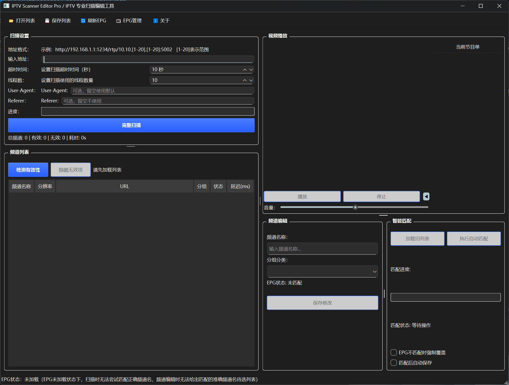
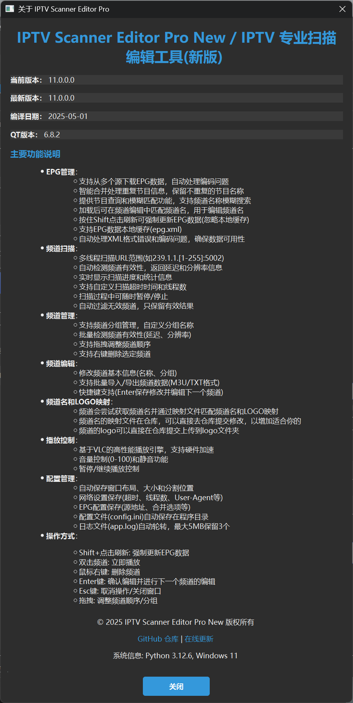
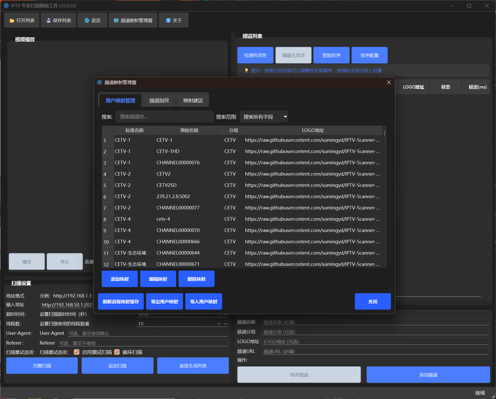
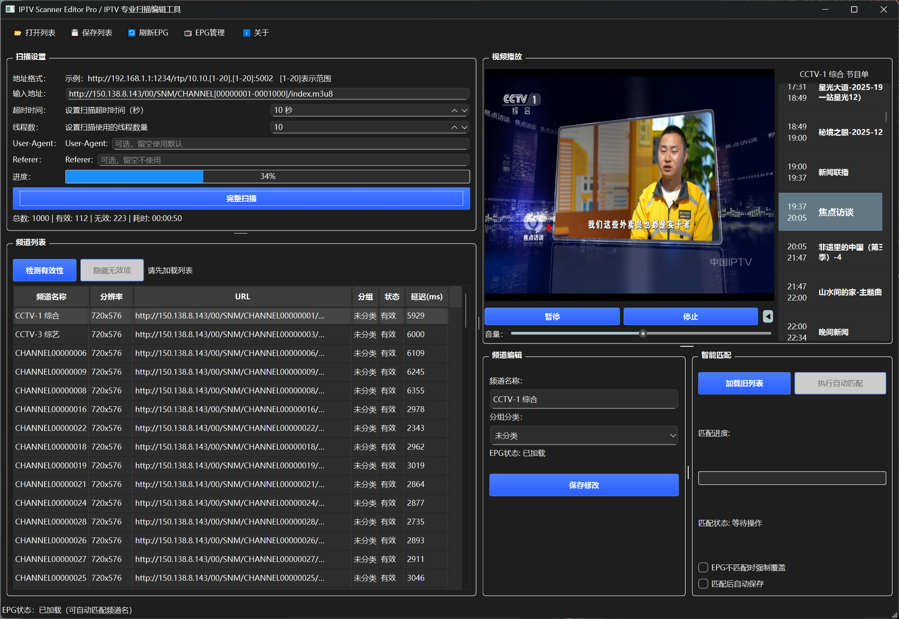
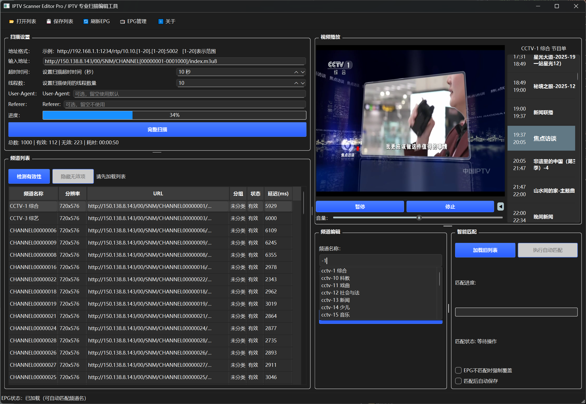

# IPTV Scanner Editor Pro / IPTV 专业扫描编辑工具

[](LICENSE)
[](https://www.python.org/)
[](https://www.riverbankcomputing.com/software/pyqt/)
[](https://www.microsoft.com/windows)

一个功能强大的 IPTV 频道扫描、验证、编辑和管理工具，支持智能频道发现、批量验证、视频播放和高级频道管理功能。

## ✨ 主要特性

### 🔍 智能频道扫描
- **范围扫描**: 支持 IP 范围扫描（如 `239.1.1.[1-255]:5002`）
- **多协议支持**: 支持单播、组播、HTTP/HTTPS 流链接
- **自定义参数**: 可设置超时时间、线程数、用户代理等
- **智能解析**: 支持复杂地址格式和多个范围的地址
- **追加扫描**: 支持在现有列表基础上追加扫描结果
- **重试扫描**: 自动重试失败的频道，支持循环扫描模式

### ✅ 高级流验证
- **批量检测**: 打开播放列表后批量检测频道有效性
- **实时统计**: 显示验证进度、有效/无效频道数量
- **性能指标**: 检测延迟、分辨率等流媒体参数
- **智能重试**: 自动重试验证失败的频道

### 🎯 智能频道管理
- **拖拽排序**: 支持拖拽调整频道顺序
- **右键操作**: 支持删除、复制频道名及URL
- **智能映射**: 自动匹配频道名、LOGO、分组信息
- **分组管理**: 支持频道分组和分类显示
- **智能排序**: 支持按分组、名称、分辨率、延迟等多条件排序
- **拼音排序**: 支持按拼音首字母排序中文频道名

### 🎬 集成视频播放
- **双击播放**: 双击频道列表直接播放当前频道
- **播放控制**: 支持播放、暂停、停止、音量调节
- **多格式支持**: 支持多种视频流格式
- **实时预览**: 播放时显示当前播放状态

### 📊 数据导入导出
- **M3U格式**: 支持标准M3U格式导入导出
- **TXT格式**: 支持简单文本格式导入导出
- **Excel格式**: 支持Excel文件导入导出（需要openpyxl）
- **批量操作**: 支持批量导入导出操作

### ⚙️ 专业工具集成
- **URL解析器**: 支持复杂地址格式解析
- **频道映射管理器**: 可视化编辑映射规则
- **错误处理系统**: 智能恢复和错误报告
- **性能优化**: 支持大规模频道列表处理
- **多语言支持**: 支持中英文界面切换
- **配置管理**: 自动保存和恢复用户设置

## 🚀 快速开始

### 下载安装

#### 方式一：直接下载可执行文件（推荐）
1. 前往 [Releases 页面](https://github.com/sumingyd/IPTV-Scanner-Editor-Pro/releases)
2. 下载最新版本的 `IPTV-Scanner-Editor-Pro-*.exe` 文件
3. 双击运行即可使用

#### 方式二：从源码运行
```bash
# 克隆仓库
git clone https://github.com/sumingyd/IPTV-Scanner-Editor-Pro.git
cd IPTV-Scanner-Editor-Pro

# 安装依赖
pip install -r requirements.txt

# 运行程序
python main.py
```

### 系统要求
- **操作系统**: Windows 10/11（推荐）
- **Python**: 3.8+（仅源码运行需要）
- **内存**: 至少 2GB RAM
- **网络**: 需要网络连接用于频道扫描和验证
- **FFmpeg**: 程序内置或系统安装FFmpeg用于流媒体分析

## 📖 使用指南

### 基本使用流程

1. **启动程序**
   - 双击可执行文件或运行 `python main.py`

2. **频道扫描**
   - 在扫描设置中输入地址格式（如 `239.1.1.[1-255]:5002`）
   - 设置超时时间和线程数
   - 点击"完整扫描"开始扫描
   - 使用"追加扫描"在现有列表基础上添加新频道

3. **列表管理**
   - 打开现有播放列表进行批量验证
   - 使用右键菜单管理频道
   - 拖拽调整频道顺序
   - 使用"隐藏无效项"过滤无效频道

4. **视频播放**
   - 双击频道列表中的任意频道开始播放
   - 使用播放控制按钮进行播放控制
   - 调整音量滑块控制音量大小

5. **数据保存**
   - 使用"保存列表"功能保存为M3U、TXT或Excel格式
   - 配置自动保存，退出时自动保存当前设置

### 高级功能

#### 智能频道映射
- 程序会自动尝试获取频道名
- 通过映射文件匹配频道名、LOGO、分组
- 频道名的映射文件在仓库，可以直接去仓库提交修改
- 频道的logo可以直接在仓库提交上传到logo文件夹

#### 批量验证
- 打开播放列表后点击"检测有效性"按钮
- 程序会批量检测所有频道的有效性
- 显示详细的统计信息和进度
- 支持自动重试失败的验证

#### 智能排序
- 支持按分组优先级排序（央视频道 > 卫视 > 地方台等）
- 支持按分辨率从高到低排序
- 支持按延迟从低到高排序
- 支持按拼音首字母排序中文频道名
- 支持自定义多条件排序规则

#### 配置管理
- 配置文件(config.ini)自动保存在程序目录
- 日志文件(app.log)自动轮转，最大5MB保留3个
- 所有设置自动保存，无需手动操作
- 支持中英文界面切换

## 🛠️ 开发说明

### 项目结构
```
IPTV-Scanner-Editor-Pro/
├── main.py                 # 主程序入口
├── requirements.txt        # Python依赖
├── pyproject.toml         # 项目配置
├── IPTV.spec              # PyInstaller打包配置
├── 一键编译.bat           # Windows编译脚本
├── README.md              # 项目说明
├── core/                  # 核心模块
│   ├── application.py     # 应用程序核心
│   ├── config_manager.py  # 配置管理
│   ├── language_manager.py # 语言管理
│   └── log_manager.py     # 日志管理
├── ui/                    # 用户界面
│   ├── main_window.py     # 主窗口
│   ├── builder.py         # UI构建器
│   ├── styles.py          # 样式定义
│   ├── optimizer.py       # UI优化器
│   └── dialogs/           # 对话框
├── services/              # 服务层
│   ├── scanner_service.py # 扫描服务
│   ├── validator_service.py # 验证服务
│   ├── player_service.py  # 播放服务
│   ├── list_service.py    # 列表服务
│   └── url_parser_service.py # URL解析服务
├── models/                # 数据模型
│   ├── channel_model.py   # 频道数据模型
│   └── channel_mappings.py # 频道映射
├── utils/                 # 工具类
│   ├── error_handler.py   # 错误处理
│   ├── progress_manager.py # 进度管理
│   ├── scan_state_manager.py # 扫描状态管理
│   ├── config_notifier.py # 配置通知
│   └── logging_helper.py  # 日志助手
├── resources/             # 资源文件
│   └── logo.ico           # 程序图标
├── locales/               # 语言文件
│   ├── zh.json           # 中文翻译
│   └── en.json           # 英文翻译
├── ffmpeg/                # FFmpeg工具
│   └── bin/              # FFmpeg可执行文件
├── vlc/                   # VLC播放器
│   └── plugins/          # VLC插件
├── icons/                 # 图标文件
├── img/                   # 频道Logo图片
└── logo/                  # Logo资源
```

### 依赖说明
- **PyQt6**: GUI框架
- **requests**: HTTP客户端库
- **python-vlc**: 视频播放支持
- **Pillow**: 图像处理库
- **openpyxl**: Excel文件处理
- **pypinyin**: 中文拼音转换（用于排序）
- **configparser**: 配置管理
- **typing-extensions**: 类型提示支持

完整依赖列表请查看 `requirements.txt` 文件。

### 编译说明
项目提供多种编译方式：
- `一键编译.bat`: 完整编译（包含VLC和FFmpeg）
- `一键编译-无vlc+ffprobe.bat`: 精简编译（不包含VLC和FFmpeg）
- `IPTV.spec`: PyInstaller打包配置文件
- `IPTV-novlc-noffprobe.spec`: 精简版打包配置

## 🤝 贡献指南

欢迎提交 Issue 和 Pull Request！

### 如何贡献
1. Fork 本仓库
2. 创建功能分支 (`git checkout -b feature/AmazingFeature`)
3. 提交更改 (`git commit -m 'Add some AmazingFeature'`)
4. 推送到分支 (`git push origin feature/AmazingFeature`)
5. 开启 Pull Request

### 提交频道映射
- 频道名映射文件在仓库中
- 可以直接去仓库提交修改
- 频道的logo可以直接在仓库提交上传到logo文件夹

## 📞 联系与支持

### QQ群
- **群号**: 757694351
- **群链接**: [点击加入群聊](https://qm.qq.com/q/lVkybTyrdK)

### 问题反馈
- 使用 GitHub Issues 报告问题
- 在 QQ 群中交流使用经验

## 💖 支持项目

如果你觉得这个项目对你有帮助，欢迎赞赏支持开发！

| 微信赞赏 | 支付宝赞赏 |
|---------|-----------|
|  |  |

## 📸 程序截图







## 📄 许可证

本项目采用 MIT 许可证 - 查看 [LICENSE](LICENSE) 文件了解详情

## 🙏 致谢

感谢所有贡献者和用户的支持！

---

**注意**: 本工具仅供学习和研究使用，请遵守相关法律法规。

**版本信息**: 当前版本基于模块化架构重构，包含完整的扫描、验证、播放和管理功能，支持多语言界面和智能重试扫描机制。
