# IPTV Scanner Editor Pro / IPTV 专业扫描编辑工具

[](LICENSE)
[](https://www.python.org/)
[](https://www.riverbankcomputing.com/software/pyqt/)
[](https://www.microsoft.com/windows)

一款功能全面的 IPTV 频道扫描、验证、播放和管理工具。集成 MPV 播放引擎，支持 EPG 电子节目单、频道台标自动匹配、多主题界面、中英双语，从扫描到观看一站式完成。

## ✨ 核心功能

### 🎬 集成播放器
- **MPV 引擎驱动**：基于 libmpv 的高性能流媒体播放
- **完整播放控制**：播放（▶）、暂停（▮▮）、停止（■）、音量调节、静音切换
- **倍速播放**：循环切换多种播放速度
- **画面比例**：支持原始/16:9/4:3/填充等多种比例模式
- **全屏播放**：F11 或按钮一键全屏，Escape 退出
- **时移/回看**：支持直播时移和历史节目回看功能
  - 多种回看类型：`default`（完整URL）、`append`（附加到直播URL）、`shift`（时移偏移）、`flussonic`/`fs`（Flussonic格式）、`xc`/`xtream`（Xtream Codes格式）
  - 时间变量替换：`${(b)format}` / `${(e)format}` 支持自定义时间格式
  - 时区偏移：`${(b)yyyyMMddHHmmss|-08:00}` 语法支持时区转换
  - `catchup-correction`：频道级时区修正参数
  - 全局回看参数：M3U 文件头 `#EXTM3U` 可定义全局 `catchup`/`catchup-source`/`catchup-days` 等属性，频道级别未设置时自动继承
- **RTSP 传输协议**：支持 TCP/UDP/LAVF 三种 RTSP 传输方式，可按需选择以适配不同网络环境
- **悬浮控制面板**：底部浮动面板显示频道信息、节目进度、媒体参数
- **OSD 信息遮罩**：Tab 键切换显示详细媒体参数（分辨率、编码、帧率、硬解、HDR、像素格式、色彩参数、码率等），支持永久显示
- **窗口置顶**：标题栏置顶按钮，一键将窗口设为最顶层
- **硬件解码**：支持 D3D11VA / NVDEC / VAAPI 等硬件加速解码
- **软件图标占位**：未播放时视频区域显示程序图标
- **画中画**：PiP 模式，在独立小窗口中继续观看，视图菜单或快捷键切换
- **多屏预览**：支持 4 屏 / 9 屏同时预览多个频道，视图菜单中切换
- **截图**：一键截取当前视频画面保存到 `screenshots/` 目录
- **音轨/字幕切换**：播放菜单和右键菜单支持切换音轨和字幕轨道
- **最近打开文件**：文件菜单记录最近访问的播放列表，快速重开

### 📺 EPG 电子节目单
- **XMLTV 格式解析**：支持标准 XMLTV / JSON 格式 EPG 数据源
- **智能匹配**：优先 tvg-id → 其次 tvg-name → 最后频道名，全部模糊匹配
- **日期导航**：查看历史/当天/未来日期的节目安排
- **实时进度条**：显示当前节目的播放进度和时间轴
- **自动订阅**：配置 EPG 地址后自动下载更新，支持过期检测和 URL 变更感知
- **Gzip 兼容**：自动识别并解压 .gz 压缩的 EPG 数据
- **M3U 内嵌 EPG**：自动识别 M3U 文件头 `x-tvg-url` / `tvg-url` / `epg-url` 等属性，未配置 EPG 源时自动加载

### 🖼️ 频道台标系统
- **智能台标匹配**：内置 400+ 频道台标规则，根据频道名称自动匹配对应台标图片
  - 覆盖央视全系列、卫视全系列、CGTN、CETV、CHC、咪咕、求索等主流频道
  - 支持动态规则：CCTV 数字频道、卫视 4K 版本、山东地方频道等自动生成
- **在线加载**：自动从播放列表 tvg-logo URL 下载台标图片
- **异步下载**：后台线程加载，不阻塞 UI
- **本地缓存**：缓存机制，减少重复下载
- **智能预加载**：滚动列表时自动预加载可见区域台标
- **高清渲染**：High-DPI 屏幕支持，原图缓存 + 显示时按需缩放
- **缩略图**：频道缩略图自动捕获服务，列表中可预览频道画面

### 🔍 智能频道扫描
- **范围扫描**：支持 IP 范围格式（如 `239.1.1.[1-255]:5002`）
- **多协议**：单播、组播、HTTP/HTTPS 流链接
- **FCC 快速换台**：支持 IPTV 组播 FCC（Fast Channel Change）代理，换台时自动向 FCC 代理发送 LEAVE/JOIN 通知，消除 IGMP 加入延迟
- **自定义参数**：超时时间、线程数、用户代理等可调
- **追加扫描**：在现有列表基础上增量添加新频道
- **重试机制**：自动重试失败的频道，支持循环扫描模式
- **批量操作**：扫描结果支持一键批量处理
  - **自动分类**：根据频道名称规则自动归类到对应分组
  - **清理名称**：去除多余括号、HD/4K 后缀、空格等，规范化频道名
  - **匹配台标**：批量匹配频道台标，支持覆盖/仅填充空位
  - **分配字段**：批量设置分组、台标等属性
  - **按组排序**：按频道分组自动排序

### ✅ 批量验证
- **有效性检测**：批量检测所有频道是否可用
- **性能指标**：检测延迟、分辨率等流媒体参数
- **实时统计**：进度条、有效/无效数量实时更新
- **智能重试**：自动重试验证失败的项

### 🎯 频道管理
- **M3U 播放列表**：支持标准 M3U/M3U8 格式导入导出
- **拖拽排序**：自由调整频道顺序
- **分组筛选**：下拉框按分组快速过滤频道
- **右键操作**：删除、复制频道名及 URL、清理名称、匹配台标等快捷操作
- **智能映射**：自动匹配频道名称、LOGO、分组信息
- **频道分类**：基于正则规则自动将频道归类到对应分组
- **名称清理**：智能去除频道名中的冗余信息，规范化显示
- **拼音排序**：中文频道名按拼音首字母排序
- **多格式导出**：M3U、TXT、Excel（需 openpyxl）

### 🎨 界面与体验
- **5 种主题**：
  - Dark（深色）
  - Light（浅色）
  - Dark Blue（暗蓝）
  - Neumorphic Light（新拟态亮色）
  - GitHub Dark（GitHub 暗色）
- **双语界面**：中文 / English 一键切换
- **三栏布局**：左侧 EPG 节目单 | 中间视频区域 | 右侧频道列表面板
- **悬浮面板**：EPG 列表、频道列表、播放控制面板均可独立开关
- **文件关联**：可自定义关联 .m3u/.m3u8/.txt 及常见视频格式，右键即可用本程序打开
- **拖放打开**：支持将文件直接拖放到主窗口打开
- **键盘快捷键**：
  - `Space` 播放/暂停
  - `F11` / `F` 全屏
  - `Tab` 切换 OSD 遮罩
  - `E` / `L` / `M` 切换面板
  - `Y` 隐藏/恢复所有悬浮面板
  - `P` 画中画
  - `↑` / `↓` 切换频道
  - `←` / `→` 快退 / 快进 10 秒
  - `滚轮` 调整音量
  - `S` 截图
  - `Ctrl+O` 打开播放列表
  - `Ctrl+Shift+O` 打开视频文件
  - `Ctrl+S` 另存为
  - `Ctrl+U` 打开流地址
  - `F5` 刷新界面
  - `Ctrl+Q` 退出

### ⚙️ 订阅与自动化
- **多源管理**：支持配置多个播放列表源和多个 EPG 源，独立管理
- **独立缓存**：每个播放列表源拥有独立的 M3U 缓存文件和更新时间记录
- **智能更新**：
  - 启动时根据各源的更新时间间隔独立判断是否需要刷新
  - 保存设置时仅对实际变化的源触发重载（改名字不重载）
  - EPG 支持增量更新——只重新下载变化的那个源并合并
- **编辑功能**：双击列表项即可编辑已添加的源或 EPG 地址
- **缓存回退**：在线下载失败时自动回退到本地缓存；缓存为空时强制在线刷新
- **过期策略**：可配置的过期时间，到期自动刷新
- **配置持久化**：所有设置自动保存到 config.ini

## 🚀 快速开始

### 方式一：直接运行（推荐）
```bash
python pyqt_player.py
```

### 方式二：从源码安装依赖
```bash
# 安装依赖
pip install -r requirements.txt

# 运行
python pyqt_player.py
```

### 系统要求
- **操作系统**：Windows 10/11
- **Python**：3.8+
- **内存**：2GB RAM 以上
- **网络**：需要网络连接用于频道扫描、EPG 下载和流媒体播放

## 📖 使用指南

### 基本流程

1. **打开播放列表**
   - 文件菜单 → 打开播放列表（Ctrl+O）
   - 支持 `.m3u` / `.m3u8` / `.txt` 格式
   - 也可直接将文件拖放到主窗口打开

2. **配置订阅（可选）**
   - 工具菜单 → 订阅设置
   - 添加多个播放列表源和 EPG 数据源地址
   - 单击列表项切换启用源，双击编辑源信息（URL / 名称）
   - 编辑模式下输入框清空可退出编辑模式
   - 配置过期时间和自动刷新策略

3. **播放频道**
   - 双击右侧频道列表中的任意频道开始播放
   - 底部控制面板：▶ 播放 / ▮▮ 暂停 / ■ 停止
   - 调节音量滑块、切换倍速、调整画面比例
   - 点击 ⛶ 全屏或按 F11
   - ↑↓ 键快速切换频道，←→ 键快退/快进，滚轮调整音量

4. **查看节目单**
   - 左侧 EPG 面板显示当前选中频道的节目安排
   - 点击 ◀ / ▶ 切换日期查看不同天的节目
   - 进度条显示当前播放位置

5. **扫描整理频道**
   - 工具菜单 → 扫描整理
   - 输入 IP 范围（如 `239.3.1.[1-100]:8000`）
   - 设置超时和线程数后开始扫描
   - 搜索过滤：输入框实时过滤频道名/URL/分组（Ctrl+F）
   - 右键菜单：全选/反选/选有效/选无效/批量删除
   - 扫描完成后可使用批量操作：自动分类、清理名称、匹配台标
   - 快捷键：Ctrl+S 保存、Ctrl+A 全选、Delete 删除选中
   - 导出时可选择仅导出选中频道

6. **保存结果**
   - 文件菜单 → 另存为（Ctrl+S）
   - 选择 M3U / TXT / Excel 格式导出

### 高级功能

#### 频道映射
- 工具菜单 → 频道映射管理器
- 可视化编辑频道名称、LOGO、分组的映射规则
- 支持提交自定义映射到仓库

#### 文件关联
- 工具菜单 → 文件关联
- 勾选需要关联的文件格式（M3U/M3U8/TXT/视频格式）
- 关联后可直接从资源管理器右键打开

#### 主题与语言
- 语言菜单：切换 中文 / English
- 主题菜单：5 种主题即时切换，全局生效

#### 面板控制
- 视图菜单或快捷键：
  - **E** — 显示/隐藏 EPG 节目单面板
  - **L** — 显示/隐藏频道列表面板
  - **M** — 显示/隐藏播放控制面板
  - **Y** — 隐藏/恢复所有悬浮面板

## 📁 项目结构

```
IPTV-Scanner-Editor-Pro/
├── pyqt_player.py              # 主窗口 & 播放器核心
├── requirements.txt            # Python 依赖
├── core/                       # 核心模块
│   ├── application_state.py    # 应用程序状态管理
│   ├── config_manager.py       # 配置管理（INI）
│   ├── language_manager.py     # 多语言管理（内置 zh/en 翻译）
│   ├── log_manager.py          # 日志管理
│   ├── panel_visibility.py     # 面板可见性状态
│   ├── play_state.py           # 播放状态枚举
│   ├── subscription_manager.py # 订阅源管理（多源/独立缓存/增量更新）
│   └── version.py              # 版本信息
├── controllers/                # 控制器层
│   ├── catchup_controller.py   # 时移/回看控制器
│   ├── channel_controller.py   # 频道管理控制器
│   ├── epg_controller.py      # EPG 电子节目单控制器
│   ├── event_handler.py       # 事件处理器
│   ├── main_window_protocol.py # 主窗口协议接口
│   ├── media_controller.py    # 媒体控制器
│   ├── multi_screen_controller.py # 多屏控制器
│   ├── pip_controller.py      # 画中画控制器
│   ├── playback_controller.py  # 播放控制
│   ├── progress_controller.py  # 进度控制器
│   ├── settings_file_ops.py    # 设置文件操作
│   ├── subscription_controller.py      # 订阅控制器
│   ├── subscription_ui_controller.py   # 订阅 UI 控制器
│   ├── ui_controller.py       # UI 控制器
│   ├── update_controller.py   # 自动更新控制器
│   └── window_controller.py    # 窗口控制器
├── models/                     # 数据模型
│   ├── channel_model.py       # 频道数据模型
│   └── channel_mappings.py    # 频道映射模型
├── services/                   # 服务层
│   ├── channel_classifier.py  # 频道自动分类服务（正则规则引擎）
│   ├── channel_cleaner.py     # 频道名称清理服务
│   ├── epg_matcher.py         # EPG 模糊匹配引擎
│   ├── fcc_service.py         # FCC 快速换台服务（组播代理通知）
│   ├── logo_cache_service.py   # 台标缓存服务（异步+DPI）
│   ├── logo_matcher.py        # 台标智能匹配服务（400+ 规则）
│   ├── m3u_parser.py          # M3U 播放列表解析器
│   ├── mpv_bindings.py        # MPV 绑定封装
│   ├── mpv_common.py          # MPV 公共模块
│   ├── mpv_player_service.py # MPV 播放引擎（libmpv）
│   ├── mpv_validator_service.py # 频道验证服务
│   ├── network_preheat_service.py # 网络预热服务
│   ├── scanner_service.py     # 频道扫描服务
│   ├── thumbnail_service.py   # 缩略图服务
│   └── url_parser_service.py  # URL 解析服务
├── ui/
│   ├── dialogs/
│   │   ├── about_dialog.py    # 关于对话框（含版本检查）
│   │   ├── file_association_dialog.py # 文件关联对话框
│   │   ├── mapping_manager_dialog.py # 映射管理器
│   │   └── scan_channel_dialog.py # 扫描频道对话框
│   ├── floating_dialog.py     # 悬浮对话框基类
│   ├── multi_screen_widget.py # 多屏窗口组件
│   ├── styles.py              # 5 套主题样式定义
│   └── theme_manager.py       # 主题管理器
├── utils/                      # 工具模块
│   ├── config_notifier.py     # 配置变更通知器
│   ├── error_handler.py       # 错误处理器
│   ├── general_utils.py       # 通用工具函数
│   ├── logging_helper.py      # 日志辅助函数
│   ├── memory_manager.py      # 内存管理器
│   ├── progress_manager.py    # 进度管理器
│   ├── resource_cleaner.py    # 资源清理器
│   ├── scan_state_manager.py  # 扫描状态管理器
│   ├── singleton.py           # 单例模式基类
│   └── thread_safety.py       # Qt 线程安全工具
├── img/                        # 台标图片库（400+ 频道 Logo）
├── resources/logo.ico          # 程序图标
├── cache/                      # 运行时缓存（自动生成）
│   ├── logo_cache/            # 台标图片缓存（从 tvg-logo URL 下载）
│   │   ├── meta.json          # 缓存元数据
│   │   └── *.png              # 各频道台标文件
│   ├── epg_cache.json         # EPG 数据缓存（全量合并）
│   ├── playlist_cache_0.m3u   # 播放列表源 #0 的独立缓存
│   ├── playlist_cache_1.m3u   # 播放列表源 #1 的独立缓存
│   └── ...                    # 每个播放列表源一个独立缓存文件
└── logo/                       # 本地频道台标图片库
```

## 🛠️ 技术栈

| 组件 | 技术 |
|---|---|
| GUI 框架 | PyQt6 |
| 播放引擎 | libmpv (MPV) |
| HTTP 客户端 | requests / aiohttp |
| 图像处理 | Pillow |
| Excel 处理 | openpyxl |
| 拼音排序 | pypinyin |

## 📸 程序截图

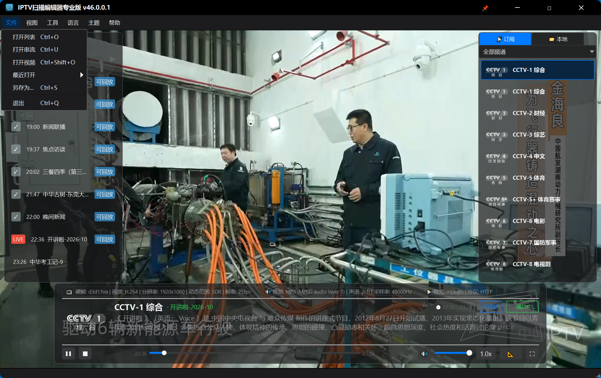
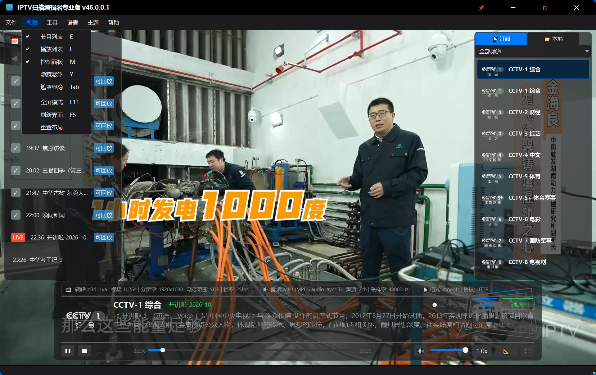
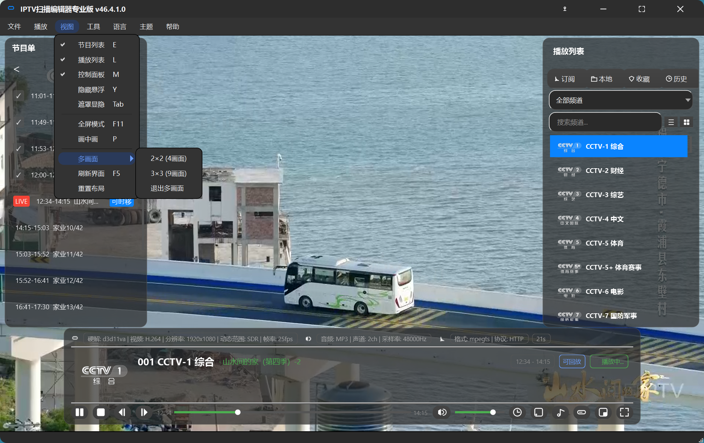
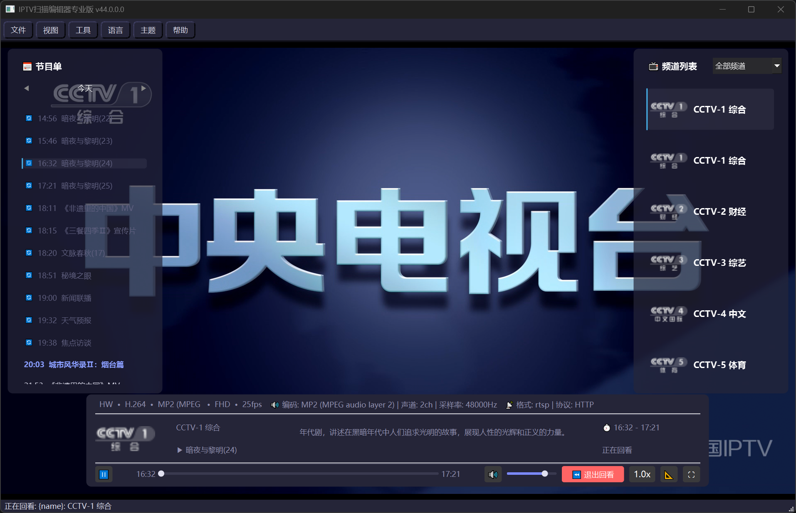
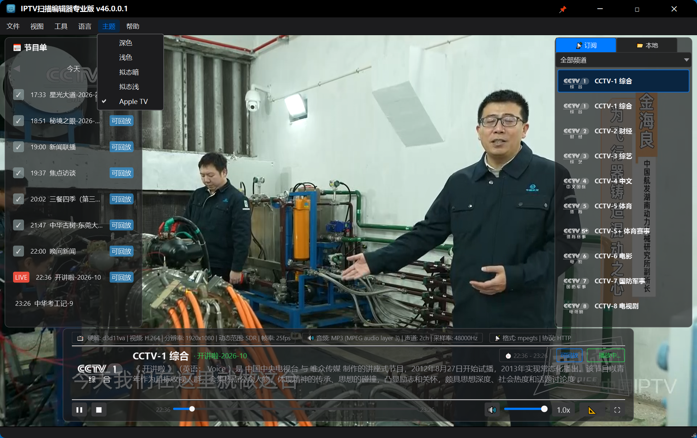
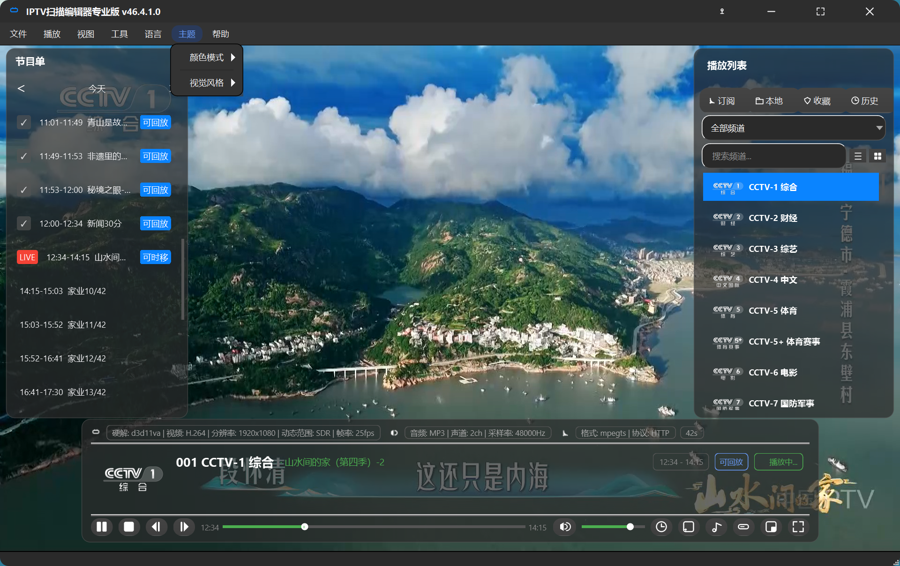
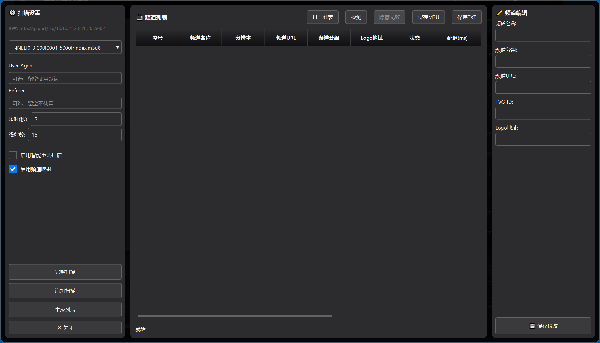
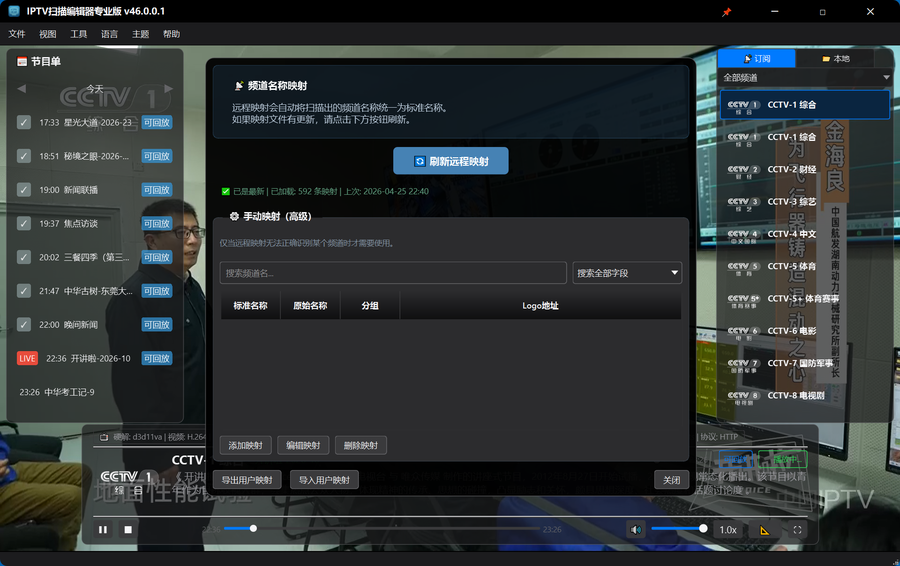
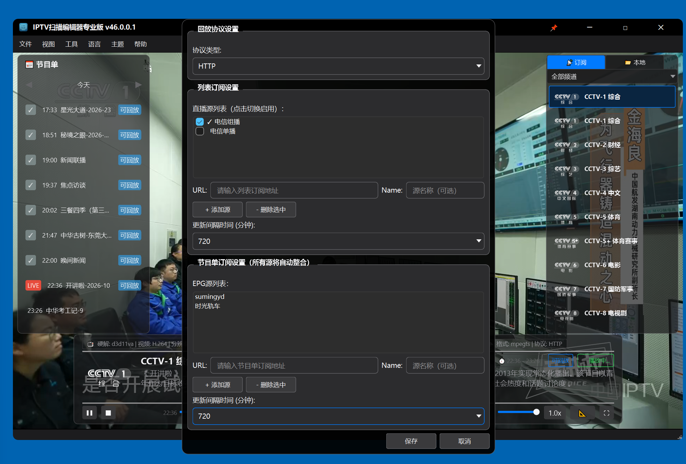
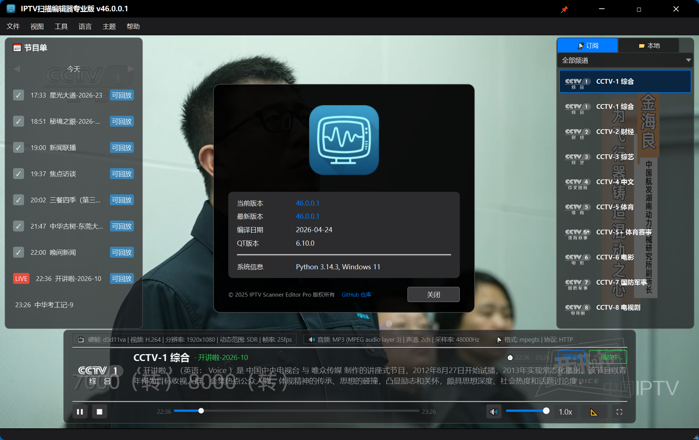
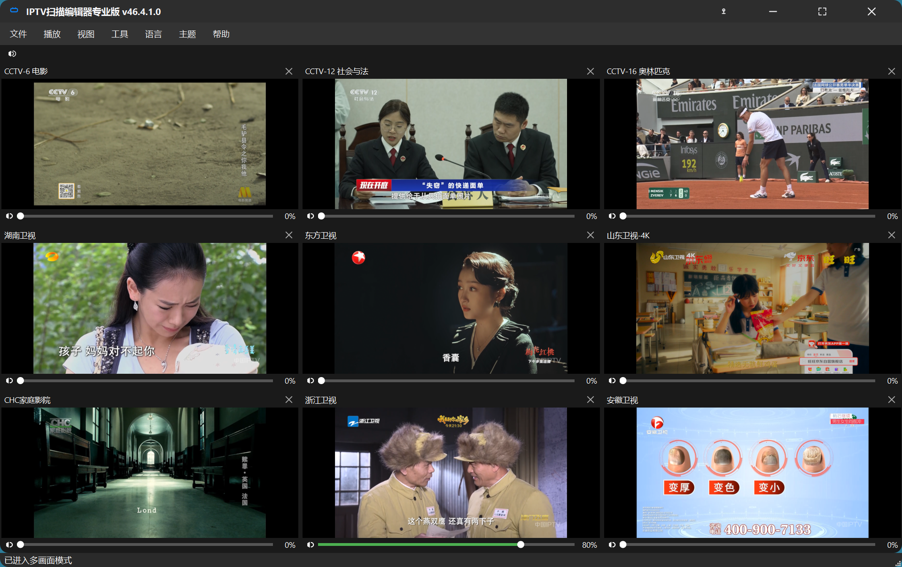
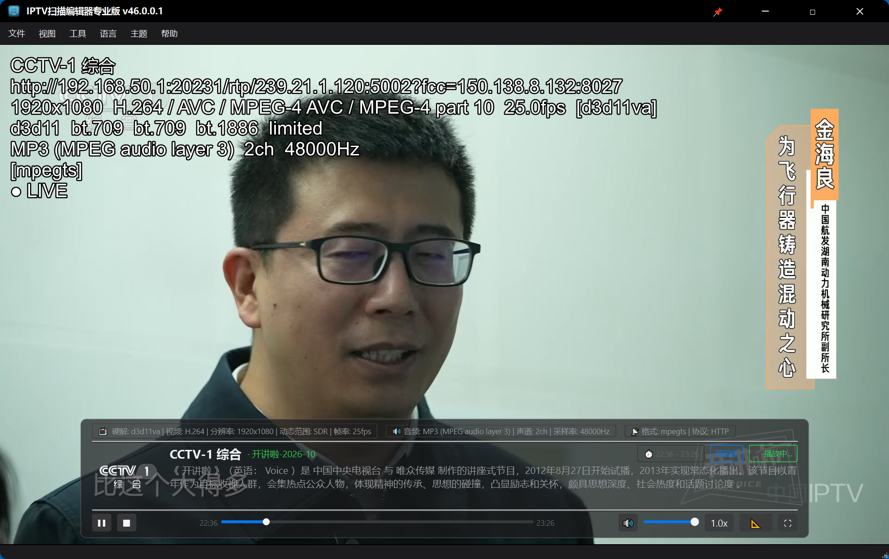

## 🤝 贡献指南

欢迎提交 Issue 和 Pull Request！

1. Fork 本仓库
2. 创建功能分支 (`git checkout -b feature/xxx`)
3. 提交更改 (`git commit -m 'Add xxx'`)
4. 推送分支 (`git push origin feature/xxx`)
5. 开启 Pull Request

### 提交内容
- **频道映射**：直接修改仓库中的映射文件并提交 PR
- **台标图片**：上传 PNG 格式的频道 Logo 到 `logo/` 或 `img/` 目录
- **语言翻译**：修改代码中的内置翻译（`BUILTIN_TRANSLATIONS`）

## 📞 联系方式

- **QQ群**：[757694351](https://qm.qq.com/q/lVkybTyrdK)
- **GitHub Issues**：[提交问题](https://github.com/sumingyd/IPTV-Scanner-Editor-Pro/issues)

## 💖 支持项目

如果你觉得这个项目对你有帮助，欢迎赞赏支持开发！

| 微信赞赏 | 支付宝赞赏 |
|---------|-----------|
|  |  |

## 📄 许可证

本项目采用 [MIT License](LICENSE) 开源。

---

*本工具仅供学习和研究使用，请遵守相关法律法规。*
